<div align="center">
<picture>
    <source srcset="https://imgur.com/5bYAzsb.png" media="(prefers-color-scheme: dark)">
    <source srcset="https://imgur.com/Os03JoE.png" media="(prefers-color-scheme: light)">
    
</picture>

<h3>Curso de Robótica 2026-I</h3>

<h1>Laboratorio No. 04: Robótica de Desarrollo</h1>
<h2>Introducción a ROS 2 Jazzy Jalisco - Turtlesim</h2>

<h4>Integrantes:<br>
    Jesus Alberto Rivera Molina<br>
    Isaac Montes Luna</h4>

<p>
  
  
  
</p>

</div>

---

## Tabla de Contenidos
1. [Descripción General](#1-descripción-general)
2. [Objetivos del Laboratorio](#2-objetivos-del-laboratorio)
3. [Estructura del Proyecto y Código Fuente](#3-estructura-del-proyecto-y-código-fuente)
4. [Familiarización con la Consola de Linux y Terminator](#4-familiarización-con-la-consola-de-linux-y-terminator)
5. [Control de Movimiento Manual](#5-control-de-movimiento-manual)
6. [Acciones Complementarias y Trayectorias Automáticas](#6-acciones-complementarias-y-trayectorias-automáticas)
7. [Dibujo Automático de Letras Personalizadas](#7-dibujo-automático-de-letras-personalizadas)
8. [Sistema Líder-Seguidor (Dos Tortugas)](#8-sistema-líder-seguidor-dos-tortugas)
9. [Diagrama de Flujo (Mermaid)](#9-diagrama-de-flujo-mermaid)
10. [Verificación de la Arquitectura ROS 2](#10-verificación-de-la-arquitectura-ros-2)
11. [Evidencias de Funcionamiento](#11-evidencias-de-funcionamiento)
12. [Video Explicativo](#12-video-explicativo)
13. [Conclusiones](#13-conclusiones)

---

## 1. Descripción General
Este laboratorio consiste en el desarrollo e implementación de un nodo en Python usando la biblioteca **rclpy** para controlar de manera avanzada el simulador `turtlesim` de ROS 2 Jazzy Jalisco en Ubuntu 24.04. Se implementa control manual no bloqueante por teclado, generación de trayectorias geométricas automáticas, dibujo de iniciales de los nombres del equipo y un sistema de control de lazo cerrado tipo líder-seguidor de dos tortugas con evasión de colisiones y límites de seguridad.

---

## 2. Objetivos del Laboratorio
* Conocer y explicar conceptos básicos de ROS 2 (Nodos, Tópicos, Servicios, Interfaces).
* Implementar nodos propios en ROS 2 mediante la biblioteca `rclpy` empleando Programación Orientada a Objetos (POO).
* Desarrollar un sistema de lectura de teclado no bloqueante mediante subprocesos y multihilo para controlar la simulación en tiempo real.
* Diseñar un algoritmo de control Proporcional (P) en lazo cerrado para implementar un comportamiento de líder-seguidor entre dos robots.
* Utilizar herramientas de inspección y análisis del grafo de comunicación (`rqt_graph` y CLI de ROS 2).

---

## 3. Estructura del Proyecto y Código Fuente
El código desarrollado se encuentra estructurado en el paquete de ROS 2 [my_turtle_controller](src/my_turtle_controller). El script de ejecución principal es [move_turtle.py](src/my_turtle_controller/my_turtle_controller/move_turtle.py), el cual está estructurado bajo el paradigma de programación orientada a objetos (POO) heredando de `rclpy.node.Node`.

---

## 4. Familiarización con la Consola de Linux y Terminator
Terminator se caractirza por su capacidad de dividir la pantalla y enviar comandos a múltiples terminales al mismo tiempo.

Esta es la lista organizada con los comandos que más se utilizaron durante el desarrollo del laboratorio:

### 4.1 Dividir Paneles (El superpoder principal)
* **`Ctrl` + `Shift` + `E`**: Divide el panel actual **verticalmente** (derecha/izquierda).
* **`Ctrl` + `Shift` + `O`** *(Letra O, no cero)*: Divide el panel actual **horizontalmente** (arriba/abajo).
* **`Ctrl` + `Shift` + `W`**: Cierra el panel actual.
* **`Ctrl` + `Shift` + `Q`**: Cierra toda la ventana de Terminator (y todos sus paneles).

### 4.2 Navegar entre Paneles
* **`Alt` + `Flechas de dirección`** (Arriba, Abajo, Izquierda, Derecha): Te mueve al panel en esa dirección.
* **`Ctrl` + `Tab`**: Cambia al siguiente panel en orden.
* **`Ctrl` + `Shift` + `Tab`**: Cambia al panel anterior.

### 4.3 Ajustar Tamaños y Visibilidad
* **`Ctrl` + `Shift` + `Flechas de dirección`**: Ajusta el tamaño (ancho/alto) del panel en el que estás actualmente.
* **`Ctrl` + `Shift` + `Z`** *(Zoom)*: Expande el panel actual para que ocupe toda la ventana (ocultando los demás). Vuelve a presionarlo para regresar a la vista dividida. Es vital cuando necesitas ver un error largo y los paneles están muy pequeños.
* **`F11`**: Pone todo Terminator en pantalla completa.

### 4.4 Multitarea Avanzada (Broadcasting)
Si tienes 4 paneles abiertos conectados a diferentes cosas y necesitas escribir el mismo comando en todos al mismo tiempo(No lo usamos en el Laboratorio pero es útil saberlo):
* **`Super` + `G`**: Agrupa todas las terminales (se les pondrá una barra de color rojo/azul en la parte superior). Todo lo que escribas en una, se escribirá en todas.
* **`Super` + `Shift` + `G`**: Deshace la agrupación.
* **`Alt` + `A`**: Activa la escritura simultánea en **todos** los paneles (Broadcast All).
* **`Alt` + `O`**: Desactiva la escritura simultánea y vuelve a la normalidad.

### 4.5 Acciones Básicas
* **`Ctrl` + `Shift` + `C`**: Copiar texto seleccionado. *(Recuerda que en la terminal `Ctrl + C` sirve para cancelar un proceso, por eso se añade el Shift).*
* **`Ctrl` + `Shift` + `V`**: Pegar texto.
* **`Ctrl` + `Shift` + `F`**: Buscar texto dentro de todo el registro de la terminal actual.
* **`Ctrl` + `Shift` + `X`**: Limpia la pantalla y el historial de desplazamiento del panel actual (como un `clear` superpotenciado).

---

## 5. Control de Movimiento Manual
El control manual permite desplazar a la tortuga principal (`turtle1`) lineal y angularmente mediante las **flechas del teclado** en tiempo real. 

### Implementación Técnica:
Para lograr que la consola lea la entrada del teclado sin congelar el flujo síncrono del nodo (lo cual provocaría la desconexión de servicios o temporizadores de ROS 2), se utiliza **multihilo (Multi-threading)**:
1. Se lanza un hilo secundario `keyboard_thread` dedicado a leer de manera exclusiva y no bloqueante la terminal con `os.read(sys.stdin.fileno(), 3)` y `select.select`.
2. Al presionar una flecha del teclado, se envía una secuencia de escape ANSI que el nodo detecta:
   * **Flecha ↑**: Avanzar hacia adelante (Velocidad lineal $1.5$ m/s).
   * **Flecha ↓**: Retroceder (Velocidad lineal $-1.5$ m/s).
   * **Flecha ←**: Girar a la izquierda (Velocidad angular $2.0$ rad/s).
   * **Flecha →**: Girar a la derecha (Velocidad angular $-2.0$ rad/s).
3. Un temporizador `motion_timer` configurado a **100 Hz** publica continuamente el mensaje `geometry_msgs/msg/Twist` en el tópico `/turtle1/cmd_vel` mientras se mantenga presionada una tecla, logrando un movimiento manual fluido.

---

## 6. Acciones Complementarias y Trayectorias Automáticas
El script incorpora trayectorias automáticas y funciones adicionales. Se implementó un manejador de concurrencia de hilos (`iniciar_trayectoria`) para interrumpir de manera segura trayectorias activas cuando se solicita una nueva, evitando movimientos superpuestos.

Las acciones implementadas son:
* **Tecla `S` (Cuadrado)**: Dibuja un cuadrado perfecto de 4 pasos (avanza $2.0$ m durante $1.0$ s y gira $90^\circ$ ($\pi/2$ rad) en cada esquina).
* **Tecla `T` (Triángulo)**: Dibuja un triángulo equilátero (avanza $2.0$ m durante $1.0$ s y realiza un giro exterior de $120^\circ$ ($2\pi/3$ rad) en cada vértice).
* **Tecla `P` (Lápiz)**: Alterna el estado del lápiz (activado/desactivado) llamando al servicio `/turtle1/set_pen` de manera asíncrona, configurando además un trazo azul de grosor $3$.
* **Tecla `X` (Evasión de Bordes)**: Ejecuta una trayectoria automática continua. El nodo lee en tiempo real el tópico `/turtle1/pose`; si la tortuga se acerca a los límites de la ventana ($<0.1$ o $>10.9$), realiza un giro autónomo de $120^\circ$ y avanza para alejarse del borde.
* **Tecla `Z` (Reiniciar)**: Interrumpe cualquier trayectoria automática, desactiva el lápiz y teletransporta a la tortuga de regreso al centro exacto ($x=5.5$, $y=5.5$, $\theta=0.0$) usando el servicio `/turtle1/teleport_absolute`.
* **Tecla `Q` (Detener)**: Envía inmediatamente un comando de velocidades nulas y desactiva todas las trayectorias en curso.

---

## 7. Dibujo Automático de Letras Personalizadas
Se desarrollaron trayectorias para dibujar las letras iniciales de los integrantes del equipo (**J**esus **A**lberto **R**ivera **M**olina e **I**saac **M**ontes **L**una), las cuales corresponden a las iniciales: **J, A, R, M, I, L**.

* **Tecla `J`**: Dibuja la letra **J** teletransportando la tortuga al inicio sin pintar, y luego realizando el trazo con avance y giros de $90^\circ$.
* **Tecla `A`**: Dibuja la letra **A** usando trayectorias inclinadas y el trazo del travesaño medio.
* **Tecla `R`**: Dibuja la letra **R** haciendo un mástil vertical, el bucle superior semicircular y la pata diagonal.
* **Tecla `M`**: Dibuja la letra **M** mediante trazos verticales y diagonales intermedios.
* **Tecla `I`**: Dibuja la letra **I** trazando la línea vertical central y los remates superior e inferior.
* **Tecla `L`**: Dibuja la letra **L** descendiendo verticalmente y extendiendo el tramo horizontal.

En cada letra, para evitar pintar líneas de transición "fantasma" entre la ubicación actual de la tortuga y el punto de inicio de la letra, el script llama automáticamente al servicio `/turtle1/set_pen` para **desactivar el lápiz**, realiza la teletransportación absoluta con `/turtle1/teleport_absolute`, espera a que finalice la acción física, **vuelve a activar el lápiz**, y procede a dibujar la letra correspondiente.

---

## 8. Sistema Líder-Seguidor (Dos Tortugas)
Se implementó un comportamiento de seguimiento automático en tiempo real usando un controlador proporcional de lazo cerrado.

### Funcionamiento y Algoritmo:
1. **Activación (`Tecla F`)**: Al presionar la tecla `F`, el nodo comprueba si existe una segunda tortuga en la simulación. Si no existe, llama al servicio `/spawn` para crear a `turtle2` en el centro exacto de la pantalla ($x=5.5$, $y=5.5$).
2. **Adquisición de Posiciones**: El nodo se suscribe a los tópicos `/turtle1/pose` y `/turtle2/pose` para obtener las coordenadas cartesianas $(x_1, y_1, \theta_1)$ de la tortuga líder y $(x_2, y_2, \theta_2)$ de la seguidora.
3. **Cálculo de Errores**: En un ciclo temporizado a **20 Hz** (`follow_timer`), se calcula:
   * El error de distancia euclidiana en 2D: 
     $$d = \sqrt{(x_1 - x_2)^2 + (y_1 - y_2)^2}$$
   * El ángulo hacia la tortuga líder:
     $$\theta_{target} = \text{atan2}(y_1 - y_2, x_1 - x_2)$$
   * El error de orientación de la tortuga seguidora:
     $$\theta_{error} = \theta_{target} - \theta_2$$
     *(El error angular se normaliza en el rango $[-\pi, \pi]$ usando `math.atan2(math.sin(e), math.cos(e))` para evitar giros de $360^\circ$ innecesarios).*
4. **Ley de Control Proporcional (P)**: 
   Si la distancia es mayor a una distancia de seguridad segura ($1.2$ unidades, para evitar colisión de texturas), se aplican las siguientes velocidades a la tortuga seguidora:
   $$v_{lineal} = K_{p\_linear} \cdot (d - d_{seguridad})$$
   $$\omega_{angular} = K_{p\_angular} \cdot \theta_{error}$$
   * Las ganancias sintonizadas para una respuesta rápida y sin sobreoscilaciones críticas son: $K_{p\_linear} = 1.5$ y $K_{p\_angular} = 5.0$.
   * Se imponen límites de velocidad máxima ($v_{lineal} \leq 3.0$ m/s y $\omega_{angular} \leq 4.0$ rad/s) para suavizar la respuesta física en el simulador.
   * Si la distancia es menor o igual a $1.2$ unidades, se publican velocidades nulas en `/turtle2/cmd_vel` para detener la tortuga.

---

## 9. Diagrama de Flujo (Mermaid)
El siguiente diagrama representa de manera clara la arquitectura del software y el flujo de comunicación multihilo implementado en [move_turtle.py](src/my_turtle_controller/my_turtle_controller/move_turtle.py):

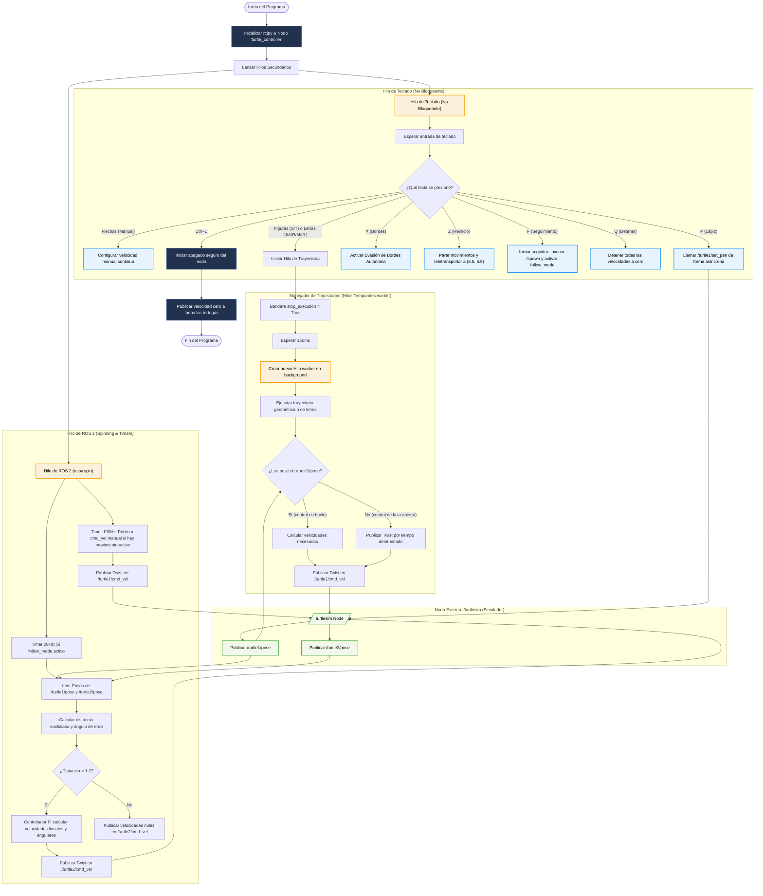

---

## 10. Verificación de la Arquitectura ROS 2
Durante la ejecución del laboratorio, se utilizaron comandos CLI y herramientas gráficas de ROS 2 para inspeccionar el flujo de comunicación. A continuación se detallan los comandos de verificación y la información que aportan al análisis del sistema:

### 10.1 `ros2 node list`
* **Explicación**: Muestra la lista de nodos actualmente activos en el grafo de ROS 2. En este laboratorio, permite verificar que el simulador (`/turtlesim`) y nuestro nodo de control (`/turtle_controller`) están corriendo en paralelo y comunicándose de manera correcta.
* **Salida de consola**:
  ```bash
  $ ros2 node list
  /turtle_controller
  /turtlesim
  ```
* **Captura de Pantalla**:

  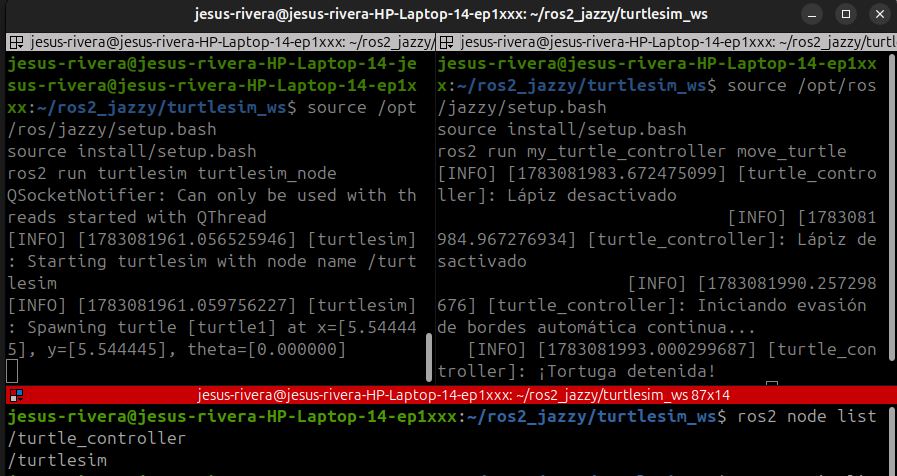

### 10.2 `ros2 topic list`
* **Explicación**: Muestra los tópicos (canales de comunicación) disponibles en el grafo actual. Permite verificar la existencia de `/turtle1/cmd_vel` y `/turtle1/pose`, así como la de `/turtle2/cmd_vel` y `/turtle2/pose` una vez activado el modo seguidor.
* **Salida de consola**:
  ```bash
  $ ros2 topic list
  /parameter_events
  /rosout
  /turtle1/cmd_vel
  /turtle1/color_sensor
  /turtle1/pose
  /turtle2/cmd_vel
  /turtle2/pose
  ```
* **Captura de Pantalla**:

  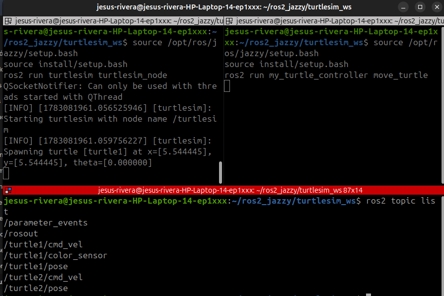

### 10.3 `ros2 topic echo /turtle1/pose`
* **Explicación**: Imprime en tiempo real los mensajes de tipo `turtlesim/msg/Pose` publicados en el tópico. Sirve para corroborar la tasa de actualización y los valores de las coordenadas $(x, y, \theta)$ de la tortuga líder al moverse.
* **Salida de consola (una muestra)**:
  ```bash
  $ ros2 topic echo --once /turtle1/pose
  x: 5.544444561004639
  y: 5.544444561004639
  theta: 0.0
  linear_velocity: 0.0
  angular_velocity: 0.0
  ---
  ```
* **Captura de Pantalla**:

  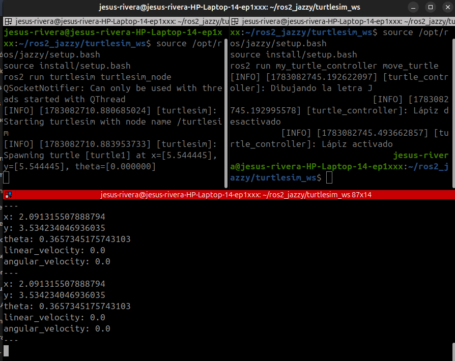

### 10.4 `ros2 topic info /turtle1/cmd_vel`
* **Explicación**: Proporciona información sobre el tipo de mensaje (`geometry_msgs/msg/Twist`) y detalla cuántos publicadores (el nodo `/turtle_controller`) y suscriptores (el simulador `/turtlesim`) están conectados a este canal de comunicación.
* **Salida de consola**:
  ```bash
  $ ros2 topic info /turtle1/cmd_vel
  Type: geometry_msgs/msg/Twist
  Publisher count: 1
  Subscription count: 1
  ```
* **Captura de Pantalla**:

  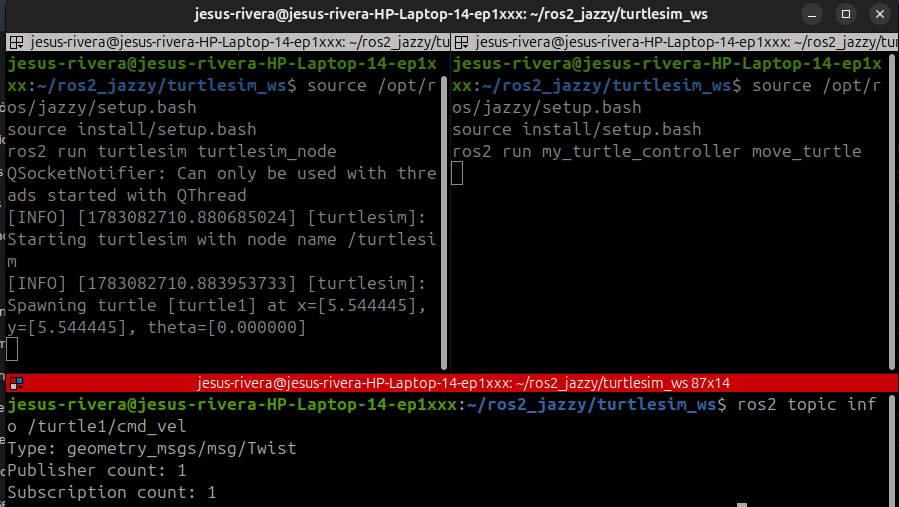

### 10.5 `ros2 service list`
* **Explicación**: Lista los servicios disponibles, permitiendo verificar que `/spawn` (usado para instanciar a turtle2), `/turtle1/set_pen` y `/turtle1/teleport_absolute` están activos y listos para ser invocados de forma síncrona.
* **Salida de consola**:
  ```bash
  $ ros2 service list
  /clear
  /kill
  /reset
  /spawn
  /turtle1/set_pen
  /turtle1/teleport_absolute
  /turtle1/teleport_relative
  /turtle_controller/describe_parameters
  /turtle_controller/get_parameter_types
  /turtle_controller/get_parameters
  /turtle_controller/get_type_description
  /turtle_controller/list_parameters
  /turtle_controller/set_parameters
  /turtle_controller/set_parameters_atomically
  /turtlesim/describe_parameters
  /turtlesim/get_parameter_types
  /turtlesim/get_parameters
  /turtlesim/get_type_description
  /turtlesim/list_parameters
  /turtlesim/set_parameters
  /turtlesim/set_parameters_atomically
  ```
* **Captura de Pantalla**:

  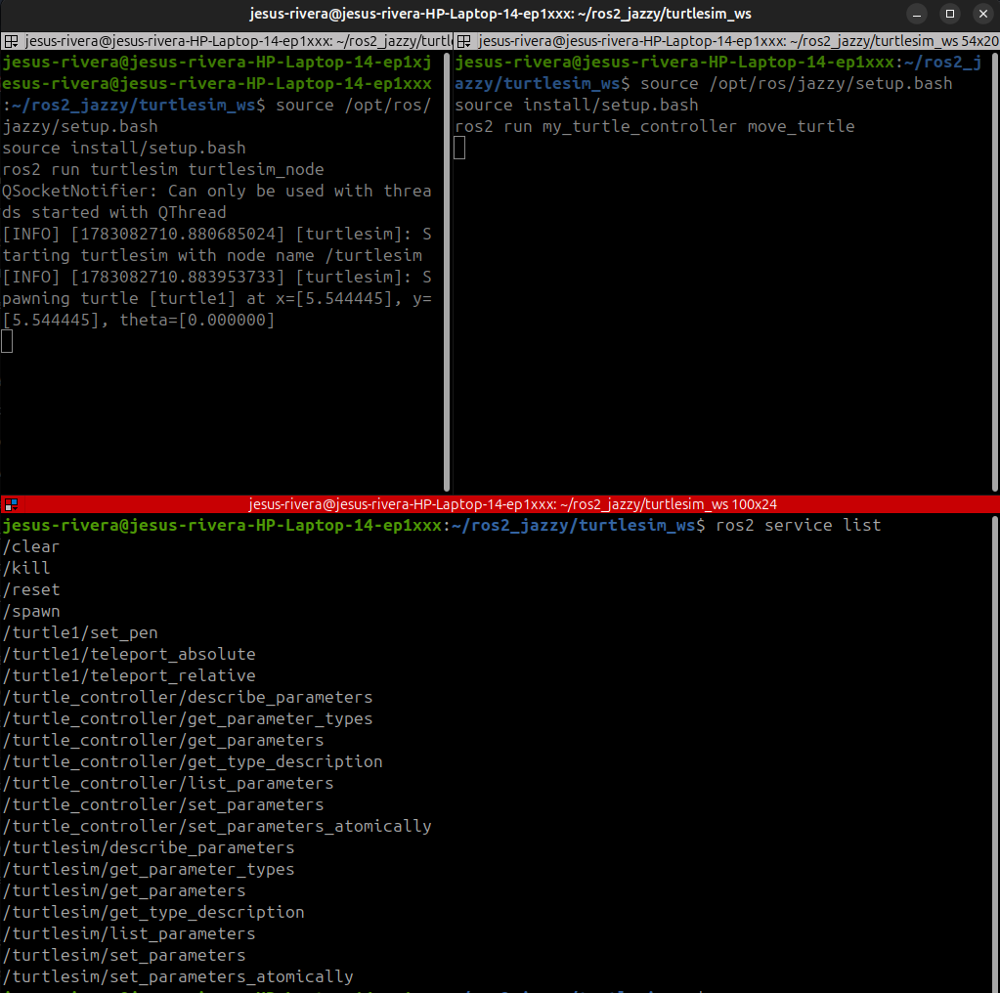

### 10.6 `rqt_graph`
* **Explicación**: Herramienta visual que grafica las conexiones del grafo de ROS 2. Evidencia con claridad los nodos como óvalos (`/turtle_controller` y `/turtlesim`) y las flechas que representan los tópicos a través de los cuales interactúan.
* **Instrucción de ejecución**:
  Ejecuta el siguiente comando en la terminal para iniciar la herramienta gráfica:
  ```bash
  $ ros2 run rqt_graph rqt_graph
  ```
* **Captura de Pantalla**:

  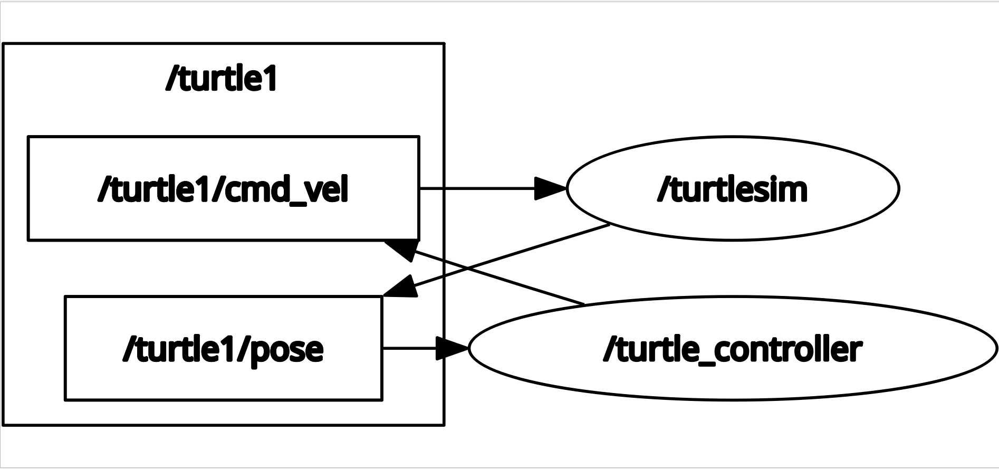

---

## 11. Evidencias de Funcionamiento
En esta sección se listan las capturas requeridas para demostrar visualmente el correcto funcionamiento de cada componente implementado en el simulador `turtlesim`.

### 11.1 Movimiento Manual de la Tortuga
* **Espacio para imagen**:
  * *Ubicación requerida*: `01_movimiento_manual.png` (dentro de la carpeta `README/`)
  * *Instrucción de captura*: Mueve a `turtle1` de forma manual usando las flechas de la terminal para dibujar un trazo curvo o libre en la ventana de Turtlesim, y toma una captura del resultado.
  
  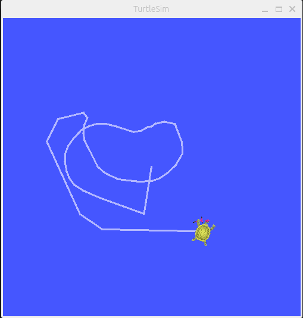

### 11.2 Dibujo de Figuras Geométricas (Cuadrado y Triángulo)
* **Espacio para imagen**:
  * *Ubicación requerida*: `02_figuras_geometricas.png` (dentro de la carpeta `README/`)
  * *Instrucción de captura*: Presiona `S` para dibujar el cuadrado y luego `T` para dibujar el triángulo (puedes reiniciar la posición en medio si lo requieres). Toma captura de la ventana de Turtlesim con las figuras completadas.
  
  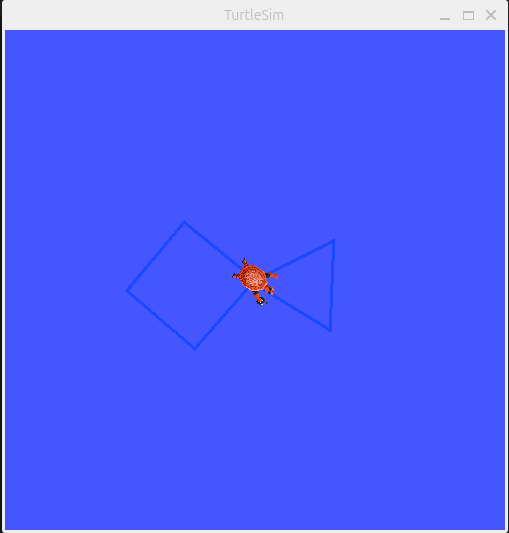

### 11.3 Dibujo de Letras Personalizadas
* **Espacio para imagen**:
  * *Ubicación requerida*: `03_letras_personalizadas.png` (dentro de la carpeta `README/`)
  * *Instrucción de captura*: Presiona de manera ordenada las letras de las iniciales (por ejemplo, `J`, `A`, `R`, `M`, `I`, `L`) y toma captura de la ventana de Turtlesim con las iniciales completas en su cuadrícula correspondiente.
  
  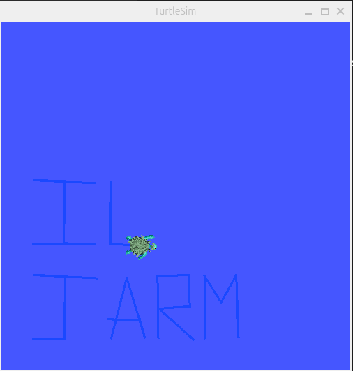

### 11.4 Funcionamiento del Sistema Líder-Seguidor
* **Espacio para imagen**:
  * *Ubicación requerida*: `04_lider_seguidor.png` (dentro de la carpeta `README/`)
  * *Instrucción de captura*: Presiona `F` para instanciar a `turtle2`, mueve la tortuga principal (`turtle1`) manualmente y captura el simulador mostrando a `turtle2` siguiendo de cerca la trayectoria de la líder y deteniéndose a la distancia segura estipulada.
  
  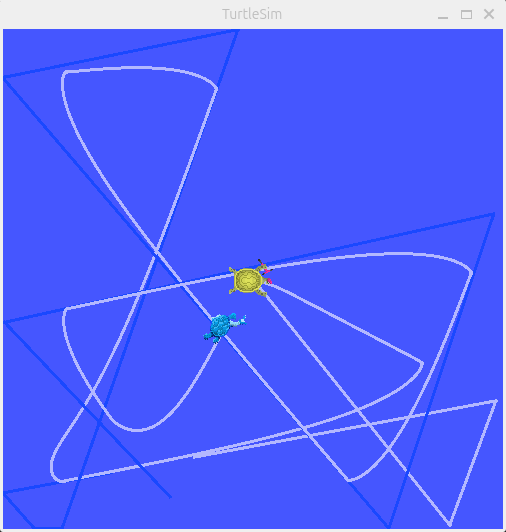

---

## 12. Video Explicativo
Para ver la explicación detallada del código fuente, el diseño del software y el funcionamiento físico en tiempo real de todos los requisitos exigidos por el laboratorio, puedes acceder al video explicativo a través del siguiente enlace:

* **Enlace al Video**: https://youtu.be/uPvSIAFEHlU?si=P5pjXYlmwXzsoX2C

---

## 13. Conclusiones
* **Modularidad y Multihilo**: El uso de hilos concurrentes (`threading`) en Python es esencial al desarrollar nodos interactivos en ROS 2 con control por terminal. Permite capturar las entradas del usuario inmediatamente sin afectar los callbacks de recepción de poses ni la ejecución del temporizador de control.
* **Control en Lazo Cerrado**: La implementación de un controlador Proporcional (P) demostró ser un método simple y sumamente eficiente para guiar a una tortuga seguidora hacia una posición dinámica. El cálculo y normalización del error angular es un paso crítico para evitar comportamientos inestables de giros sobre su propio eje.
* **Uso de Servicios y Tópicos**: Se consolidó la diferencia práctica entre la comunicación continua asíncrona mediante tópicos (como `/cmd_vel` y `/pose`) y la interacción puntual síncrona tipo solicitud/respuesta mediante servicios (`/spawn`, `/set_pen`, `/teleport_absolute`).
</div>
