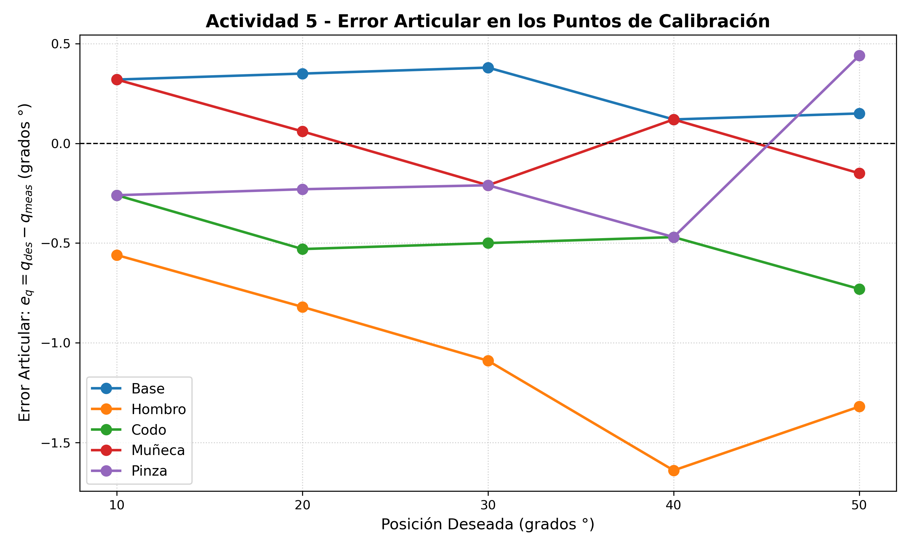
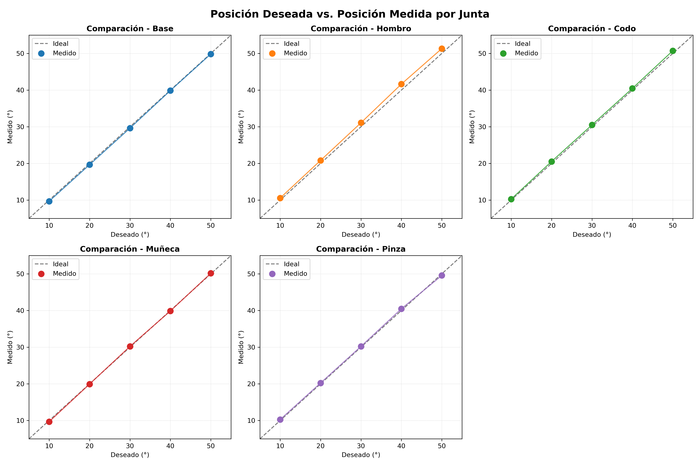
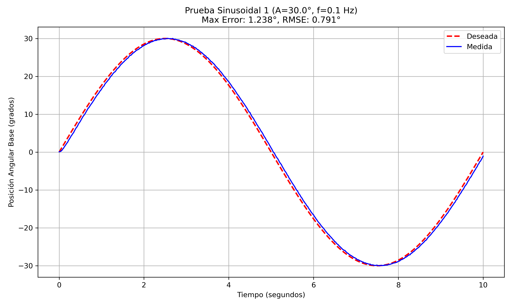
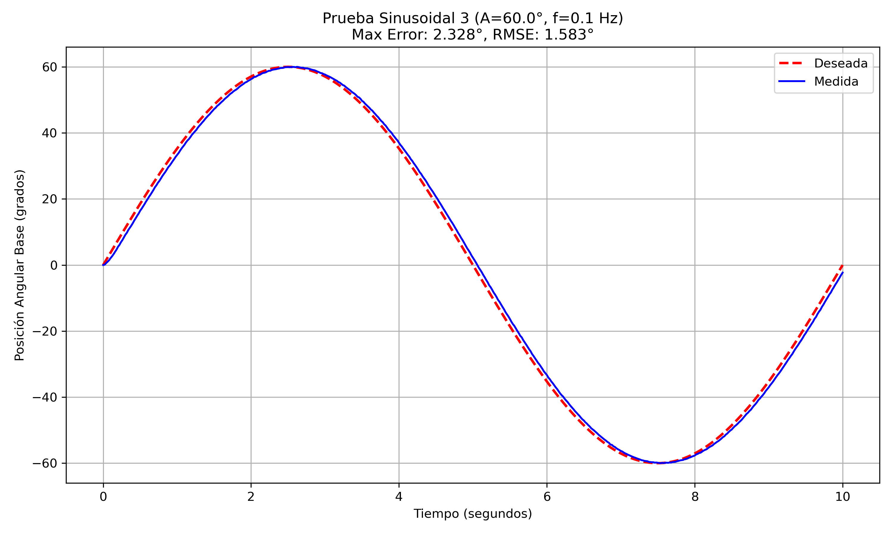
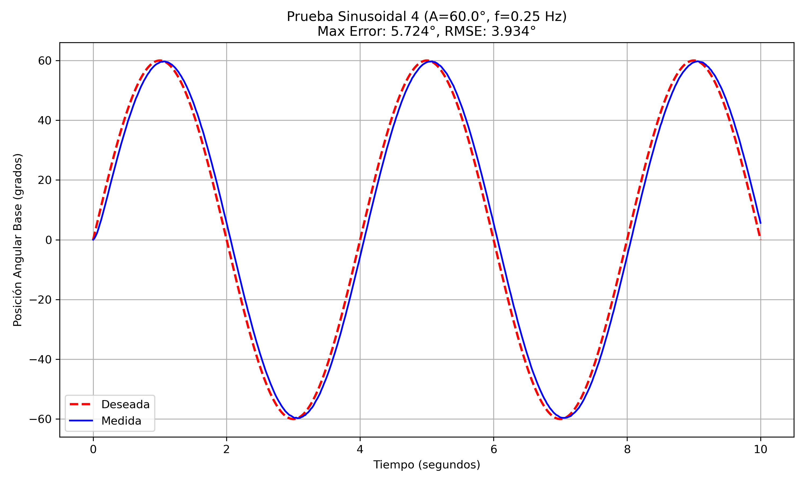
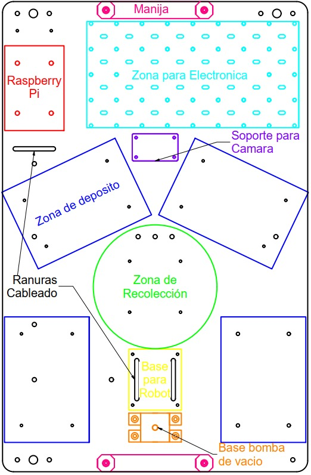
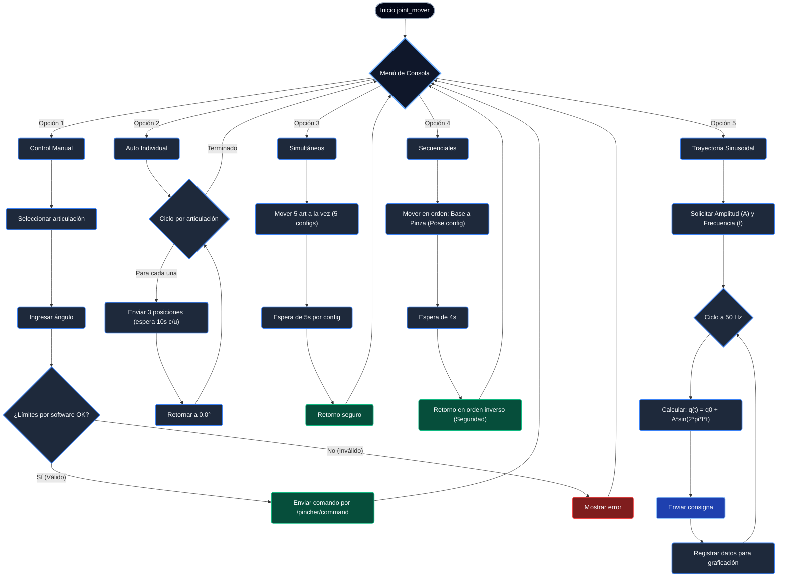
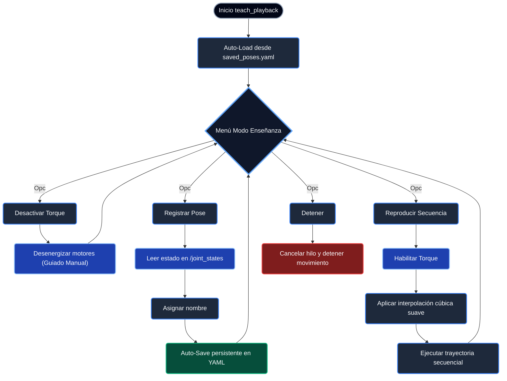
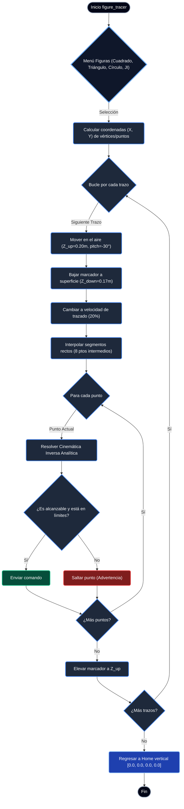

<div align="center">
<picture>
    <source srcset="https://imgur.com/5bYAzsb.png" media="(prefers-color-scheme: dark)">
    <source srcset="https://imgur.com/Os03JoE.png" media="(prefers-color-scheme: light)">
    
</picture>

<h3>Curso de Robótica 2026-I</h3>

<h1>PhantomX Pincher X100 con ROS 2 Jazzy</h1>

<h2>Laboratorio No. 05 - Cinemática - Pincher Phantom X100</h2>

<h4>Jesus Alberto Rivera Molina - jriveramo@unal.edu.co<br>
    Isaac Montes Luna - imontesl@unal.edu.co</h4>

<p>
  
  
  
  
</p>

</div>

---

## 1. Objetivos del Laboratorio
- Controlar las articulaciones del robot Phantom X Pincher X100 utilizando ROS 2 Jazzy.
- Medir y modelar la geometría del manipulador.
- Implementar movimientos individuales, simultáneos, secuenciales e interpolados.
- Aplicar cinemática directa e inversa.
- Programar trayectorias, repetición de poses y tareas artísticas con el robot.

---

## 2. Requisitos y Dependencias
- **Sistema Operativo**: Ubuntu 24.04 LTS.
- **Middleware**: ROS 2 Jazzy Jalisco.
- **Lenguaje**: Python 3.
- **Herramienta de Construcción**: `colcon`.
- **Hardware**: Robot Phantom X Pincher X100, fuente de alimentación y sistema de comunicación (servomotores DYNAMIXEL).
- **Herramientas Adicionales**: Calibrador (para mediciones físicas) y soporte para marcador liviano.


---

## 3. Repositorios Base Utilizados
- **Visualización y control del robot en ROS 2 Jazzy**:
  [06_Rob_2026_I_ROS2_Jazzy_PhantomX100_RVIZ](https://github.com/labsir-un/06_Rob_2026_I_ROS2_Jazzy_PhantomX100_RVIZ.git)
- **Kit Phantom X Pincher para ROS 2**:
  [KIT_Phantom_X_Pincher_ROS2](https://github.com/labsir-un/KIT_Phantom_X_Pincher_ROS2.git)
- **Archivos tridimensionales del robot**:
  [3DModels_KIT_Phantom_Pincher_X100](https://github.com/labsir-un/3DModels_KIT_Phantom_Pincher_X100.git)

---

## 4. Condiciones de Operación Segura
1. El robot debe iniciar y finalizar cada prueba en una posición segura.
2. Todos los valores de consigna enviados deben respetar los límites articulares.
3. Los movimientos de gran amplitud deben realizarse mediante trayectorias interpoladas para evitar desgastes y golpes.
4. No se debe sujetar ni bloquear manualmente el robot mientras los servomotores estén energizados.
5. Cada movimiento debe verificarse en el entorno de simulación (RViz) antes de ejecutarse sobre el robot real.

---

## 5. Estructura del Repositorio y Entregables
De acuerdo con las pautas de entrega, este repositorio cuenta con la siguiente estructura de archivos detallada:

```text
Laboratorio No. 05 - Robótica de Desarrollo ROS Jazzy y Phantom Pincher X100/
├── README.md                                # Este archivo con la documentación del laboratorio
├── doc/                                     # Documentación gráfica y planos del laboratorio
│   ├── diagrama_de_flujo.png                # Diagrama de flujo de las acciones del robot
│   ├── plano_de_planta.jpeg                 # Plano de planta del entorno de trabajo
│   └── diagrama_geometrico.png              # Diagrama geométrico y sistemas coordenados
├── results/                                 # Gráficas obtenidas durante las pruebas
│   ├── calibracion/                         # Gráficas de error y calibración de cero
│   │   ├── comparativa_calibracion.png      # Comparativa de posición deseada vs. medida
│   │   └── error_calibracion.png            # Histograma/Gráfica del error articular
│   ├── interpolacion/                       # Gráficas de trayectorias interpoladas (lineal/cúbica)
│   │   ├── comparativa_interpolacion.png    # Comparación de perfiles de velocidad/posición (Base)
│   │   ├── interpolacion_cubica.png         # Posición y velocidad de todas las juntas (cúbica)
│   │   └── interpolacion_lineal.png         # Posición y velocidad de todas las juntas (lineal)
│   └── sinusoidal/                          # Gráficas de trayectorias sinusoidales (Base)
│       ├── test_1.png                       # Trayectoria sinusoidal con A=30°, f=0.1Hz
│       ├── test_2.png                       # Trayectoria sinusoidal con A=30°, f=0.25Hz
│       ├── test_3.png                       # Trayectoria sinusoidal con A=60°, f=0.1Hz
│       └── test_4.png                       # Trayectoria sinusoidal con A=60°, f=0.25Hz
├── videos/                                  # Enlaces o archivos de video demostrativos
└── src/                                     # Código fuente de los paquetes de ROS 2
    ├── pincher_description/                 # Descripción URDF y mallas del manipulador
    │   ├── launch/
    │   │   ├── display.launch.py            # Lanzador para visualizar en RViz2 (con mallas/cajas)
    │   │   └── display_gui.launch.py        # Lanzador interactivo con joint_state_publisher_gui
    │   ├── meshes/                          # Archivos STL con la geometría 3D del robot
    │   │   └── *.stl
    │   ├── rviz/
    │   │   └── pincher.rviz                 # Configuración de visualización en RViz2
    │   ├── urdf/
    │   │   └── robot.xacro                  # Modelo cinemático en Xacro (Home vertical)
    │   ├── package.xml
    │   └── setup.py
    └── pincher_control/                     # Paquete de control e interacción con motores
        ├── config/
        │   ├── ax12a.yaml                   # Configuración del perfil de servomotor AX-12A
        │   ├── xl430.yaml                   # Configuración del perfil de servomotor XL430-W250
        │   └── saved_poses.yaml             # Archivo YAML de poses registradas (Actividad 13)
        ├── launch/
        │   └── pincher_system.launch.py     # Lanzador principal (gui + control_servo + rviz)
        ├── pincher_control/                 # Nodos y scripts principales en Python
        │   ├── __init__.py
        │   ├── control_servo.py             # Nodo ROS 2 que interactúa con DynamixelSDK
        │   ├── dynamixel_profiles.py        # Perfiles de registros Dynamixel
        │   ├── joint_mover.py               # Nodo por consola para control articular individual y secuencial
        │   ├── pincher_gui.py               # Interfaz gráfica (Tkinter) para sliders y torque
        │   ├── scan_dynamixel.py            # Utilidad de escaneo de IDs en el bus
        │   ├── trajectory_interpolator.py   # Interpolador de trayectorias lineal/cúbica (Actividad 9)
        │   ├── direct_kinematics.py         # Nodo de cinemática directa y DH (Actividad 11)
        │   ├── inverse_kinematics.py        # Nodo resolvedor de cinemática inversa (Actividad 12)
        │   ├── teach_playback.py            # Nodo interactivo de enseñanza y reproducción (Actividad 13)
        │   ├── figure_tracer.py             # Nodo para trazado cartesiano de figuras (Actividad 14)
        │   └── choreography.py              # Nodo para reproducir la coreografía sincronizada (Actividad 15)
        ├── package.xml
        └── setup.py
```


---

## 6. Desarrollo de las Actividades

### Actividad 1. Preparación del Robot
*Detalles sobre la conexión, posicionamiento inicial del manipulador, energización y sincronización entre el modelo virtual en RViz y el robot físico.*

Se configuró y compiló el espacio de trabajo `phantom_ws` bajo ROS 2 Jazzy. Se diseñó el modelo URDF en `robot.xacro` definiendo eslabones y articulaciones del PhantomX Pincher X100, configurando su pose inicial (Home) de manera que se visualice completamente vertical en RViz. Para la visualización e interacción virtual, se crearon los lanzamientos `display.launch.py` (visualización base con mallas STL o cajas) y `display_gui.launch.py` (interfaz interactiva para publicar estados articulares). El sistema físico se conecta mediante interfaz USB-Serial con servomotores DYNAMIXEL (XL430 o AX-12A), sincronizándose en tiempo real mediante el nodo `control_servo` que publica los estados en `/joint_states`.

### Actividad 2. Identificación de Motores y Articulaciones
Tabla resumen con los servomotores DYNAMIXEL que conforman el robot:

| Articulación | ID DYNAMIXEL | Referencia (0 rad / 0°) | Sentido Positivo | Función |
| :--- | :---: | :--- | :--- | :--- |
| **Base** | 1 | Vertical (Eje Z positivo) | Antihorario (vista superior) | Rotación de la estructura sobre el plano XY |
| **Hombro** | 2 | Vertical (Eje Z positivo) | Hacia adelante (flexión) | Elevación y descenso del brazo |
| **Codo** | 3 | Vertical (colineal al Hombro) | Hacia adelante (flexión) | Extensión y flexión del antebrazo |
| **Muñeca** | 4 | Vertical (colineal al Codo) | Hacia abajo (flexión) | Ajuste de orientación/cabeceo del TCP |
| **Pinza** | 5 | Totalmente abierta | Apertura de los dedos | Agarre y sujeción de objetos |

### Actividad 3. Medición del Robot
Dimensiones físicas y geométricas del manipulador obtenidas a partir de los archivos URDF/STL y especificaciones técnicas:
- *Altura de la base (Suelo a Eje del Hombro)*: 89.45 mm
- *Distancia entre ejes consecutivos*:
  - Eje 1 (Base) a Eje 2 (Hombro): 89.45 mm
  - Eje 2 (Hombro) a Eje 3 (Codo): 105.8 mm (distancia euclidiana considerando offset Lm = 31.5 mm y altura L2 = 101.0 mm)
  - Eje 3 (Codo) a Eje 4 (Muñeca): 105.8 mm (L3)
- *Longitud de eslabones principales*:
  - Eslabón 1 (Hombro/Upper arm): 101.0 mm (L2) con offset lateral de 31.5 mm (Lm)
  - Eslabón 2 (Codo/Forearm): 101.0 mm (L3)
- *Distancia desde la última articulación (Muñeca) hasta el TCP*: 119.0 mm (L4)
- *Dimensiones principales de la pinza*: Barra de soporte de 75.0 mm de ancho; dedos/fingers de 70.0 mm de longitud.


### Actividad 4. Movimiento Individual de Articulaciones
*Desarrollo del nodo que permite controlar cada articulación de forma independiente.*
- **Nodo**: `joint_mover` (paquete `pincher_control`)
- **Comando de ejecución**:
  ```bash
  ros2 run pincher_control joint_mover
  ```
- **Descripción**: El programa inicia configurando automáticamente la velocidad máxima al 30% para asegurar movimientos suaves. Implementa una interfaz de consola interactiva multihilo que no bloquea la recepción de `/joint_states`. Permite realizar:
  1. **Control manual individual (opción 1)**: Selección de una junta, visualización de su ángulo actual en grados y envío de la consigna deseada (validando los límites seguros).
  2. **Rutina de movimientos independientes automática (opción 2)**: Mueve cada articulación por 3 posiciones de prueba distintas (ej. Base a 45°, -45° y 90°) esperando 10 segundos en cada una, y retornando a 0.0° antes de pasar a la siguiente junta.
  3. **Rutina de movimientos simultáneos (opción 3 - Actividad 7)**: Mueve las 5 articulaciones al mismo tiempo hacia las 5 configuraciones de prueba secuencialmente, esperando 5 segundos por pose.
  4. **Rutina de movimientos secuenciales (opción 4 - Actividad 8)**: Mueve las articulaciones paso a paso en el orden establecido hacia la 4ª configuración, esperando 4 segundos por junta, y retornando en orden inverso por seguridad.

### Actividad 5. Calibración de Cero y Error Articular
*Análisis del error de posicionamiento articular medido en 5 puntos distintos del rango seguro.*

- **Fórmula del error**:
  $$e_q = q_{\text{deseado}} - q_{\text{medido}}$$

#### 1. Datos Medidos en el Laboratorio (Valores en Grados °)
| Deseado ($q_{\text{deseado}}$) | Base ($q_{\text{medido}}$) | Hombro ($q_{\text{medido}}$) | Codo ($q_{\text{medido}}$) | Muñeca ($q_{\text{medido}}$) | Pinza ($q_{\text{medido}}$) |
| :---: | :---: | :---: | :---: | :---: | :---: |
| **10.0°** | 9.68° | 10.56° | 10.26° | 9.68° | 10.26° |
| **20.0°** | 19.65° | 20.82° | 20.53° | 19.94° | 20.23° |
| **30.0°** | 29.62° | 31.09° | 30.50° | 30.21° | 30.21° |
| **40.0°** | 39.88° | 41.64° | 40.47° | 39.88° | 40.47° |
| **50.0°** | 49.85° | 51.32° | 50.73° | 50.15° | 49.56° |

#### 2. Tabla de Errores Calculados ($e_q$) en Grados y Radianes
| Articulación | $10^\circ$ | $20^\circ$ | $30^\circ$ | $40^\circ$ | $50^\circ$ |
| :--- | :---: | :---: | :---: | :---: | :---: |
| **Base** | +0.32° (+0.00559 rad) | +0.35° (+0.00611 rad) | +0.38° (+0.00663 rad) | +0.12° (+0.00209 rad) | +0.15° (+0.00262 rad) |
| **Hombro** | -0.56° (-0.00977 rad) | -0.82° (-0.01431 rad) | -1.09° (-0.01902 rad) | -1.64° (-0.02862 rad) | -1.32° (-0.02304 rad) |
| **Codo** | -0.26° (-0.00454 rad) | -0.53° (-0.00925 rad) | -0.50° (-0.00873 rad) | -0.47° (-0.00820 rad) | -0.73° (-0.01274 rad) |
| **Muñeca** | +0.32° (+0.00559 rad) | +0.06° (+0.00105 rad) | -0.21° (-0.00367 rad) | +0.12° (+0.00209 rad) | -0.15° (-0.00262 rad) |
| **Pinza** | -0.26° (-0.00454 rad) | -0.23° (-0.00401 rad) | -0.21° (-0.00367 rad) | -0.47° (-0.00820 rad) | +0.44° (+0.00768 rad) |

#### 3. Métricas Resumen del Error
- **Base**:
  - Error Máximo: 0.38° (0.00663 rad)
  - Error Promedio: 0.26° (0.00461 rad)
  - Offset Cero Estimado: 0.26° (0.00461 rad)
- **Hombro**:
  - Error Máximo: 1.64° (0.02862 rad)
  - Error Promedio: -1.09° (-0.01895 rad)
  - Offset Cero Estimado: -1.09° (-0.01895 rad)
- **Codo**:
  - Error Máximo: 0.73° (0.01274 rad)
  - Error Promedio: -0.50° (-0.00869 rad)
  - Offset Cero Estimado: -0.50° (-0.00869 rad)
- **Muñeca**:
  - Error Máximo: 0.32° (0.00559 rad)
  - Error Promedio: 0.03° (0.00049 rad)
  - Offset Cero Estimado: 0.03° (0.00049 rad)
- **Pinza**:
  - Error Máximo: 0.47° (0.00820 rad)
  - Error Promedio: -0.15° (-0.00255 rad)
  - Offset Cero Estimado: -0.15° (-0.00255 rad)

- **Gráficas**:
  Las gráficas generadas de las pruebas de calibración se encuentran en:
  * Gráfica de error articular: 
  
  * Gráfica comparativa deseado vs. medido: 
  

### Actividad 6. Determinación de Límites Seguros
Definición de los límites físicos y los límites de movimiento seguro por software (con un margen de seguridad de $10.0^\circ$ o $0.175\text{ rad}$) para la protección mecánica del manipulador, validados activamente en `control_servo.py`, `joint_mover.py` y `pincher_gui.py`:

| Articulación | Límite Inf. (Físico) | Límite Sup. (Físico) | Margen de Seguridad | Límite Inf. Seguro (Software) | Límite Sup. Seguro (Software) |
| :--- | :---: | :---: | :---: | :---: | :---: |
| **Base** | -150.0° (-2.618 rad) | 149.0° (2.601 rad) | 10.0° (0.175 rad) | -140.0° (-2.443 rad) | 139.0° (2.426 rad) |
| **Hombro** | -116.0° (-2.025 rad) | 74.0° (1.292 rad) | 10.0° (0.175 rad) | -106.0° (-1.850 rad) | 64.0° (1.117 rad) |
| **Codo** | -141.0° (-2.461 rad) | 147.0° (2.566 rad) | 10.0° (0.175 rad) | -131.0° (-2.286 rad) | 137.0° (2.391 rad) |
| **Muñeca** | -103.0° (-1.798 rad) | 103.0° (1.798 rad) | 10.0° (0.175 rad) | -93.0° (-1.623 rad) | 93.0° (1.623 rad) |
| **Pinza** | -120.0° (-2.094 rad) | 120.0° (2.094 rad) | 10.0° (0.175 rad) | -110.0° (-1.920 rad) | 110.0° (1.920 rad) |

*El código del nodo de control interactivo por consola y la interfaz gráfica validan los comandos contra los límites seguros (Software) antes de transmitir las consignas a los motores.*

### Actividad 7. Movimiento Simultáneo
Ejecución de configuraciones angulares conjuntas de las 5 articulaciones, enviadas en un único mensaje de tipo `sensor_msgs/msg/JointState` a `/pincher/command`:

- **Comando de ejecución**:
  ```bash
  # Iniciar la secuencia automática de movimiento simultáneo (Opción 3)
  ros2 run pincher_control joint_mover
  ```

1. **Configuración 1**: `[0, 0, 0, 0, 0]` -> Posición vertical de reposo/seguridad (Home). Verificada en simulación y hardware.
2. **Configuración 2**: `[25, 25, 20, -20, 0]` -> Inclinación suave hacia el frente y derecha. Verificada.
3. **Configuración 3**: `[-35, 35, -30, 30, 0]` -> Inclinación hacia la izquierda con compensación de cabeceo. Verificada.
4. **Configuración 4**: `[85, -20, 55, 25, 0]` -> Extensión lateral pronunciada hacia la derecha. Verificada.
5. **Configuración 5**: `[80, -35, 55, -45, 0]` -> Posición extendida hacia la derecha con orientación del gripper inclinada hacia abajo. Verificada.

*Nota: La secuencia se ejecuta de forma completamente automática desde la opción 3 del menú, pausando 5 segundos entre configuraciones para estabilización y retornando automáticamente a Home al finalizar.*

### Actividad 8. Movimiento Secuencial
*Ejecución de la 4ª configuración del movimiento simultáneo realizando giros secuenciales en el orden: Base -> Hombro -> Codo -> Muñeca -> Pinza.*

- **Comando de ejecución**:
  ```bash
  # Iniciar la secuencia automática de movimiento secuencial (Opción 4)
  ros2 run pincher_control joint_mover
  ```

- **Tabla Comparativa: Simultáneo vs. Secuencial**:
  
  | Criterio | Movimiento Simultáneo (Actividad 7) | Movimiento Secuencial (Actividad 8) |
  | :--- | :--- | :--- |
  | **Tiempo de Ejecución** | **Mínimo** (~4 segundos). Todas las articulaciones se mueven al mismo tiempo. | **Máximo** (~20 segundos). Las articulaciones se mueven una por una esperando la anterior. |
  | **Trayectoria del TCP** | **Directa/Curva**. El TCP se desplaza trazando una trayectoria tridimensional suave y directa al punto final. | **Ortogonal/Segmentada**. El TCP realiza movimientos escalonados (rotación en plano horizontal, flexión de hombro, extensión de codo, etc.). |
  | **Suavidad** | **Alta**. Las aceleraciones y desaceleraciones de los motores se superponen, evitando sacudidas bruscas. | **Baja-Media**. Paradas y arranques bruscos en cada transición de junta. |
  | **Seguridad de Operación** | **Alta** (siempre que la trayectoria directa esté libre de obstáculos). | **Muy Alta** (permite vigilar colisiones paso a paso, ideal para calibración o espacios reducidos). |

*Nota: La secuencia de retorno a 0.0° se realiza en orden inverso (Pinza -> Muñeca -> Codo -> Hombro -> Base) con esperas de 4 segundos por articulación, garantizando la seguridad mecánica del manipulador al replegarse.*

### Actividad 9. Interpolación de Trayectorias
*Nodo para mover el robot entre dos configuraciones lejanas usando perfiles interpolados:*

- **Nodo**: `trajectory_interpolator` (paquete `pincher_control`)
- **Comando de ejecución**:
  ```bash
  ros2 run pincher_control trajectory_interpolator
  ```
- **Descripción**: Se implementó una herramienta interactiva para mover las articulaciones del robot entre dos configuraciones alejadas en el espacio de articulaciones:
  * **Configuración A (Inicio)**: `[-60.0°, -45.0°, 45.0°, -30.0°, 0.0°]`
  * **Configuración B (Fin)**: `[60.0°, 30.0°, -30.0°, 30.0°, 0.0°]`
  La trayectoria tiene una duración parametrizada de 5 segundos y se calcula a una frecuencia de actualización de 50 Hz ($dt = 0.02\text{ s}$).

#### Métodos de Interpolación Implementados:
1. **Interpolación Lineal**:
   * **Posición**: $q(t) = q_A + \frac{t}{T}(q_B - q_A)$
   * **Velocidad**: $v(t) = \frac{q_B - q_A}{T}$
   * *Comportamiento*: La velocidad angular de cada articulación es constante a lo largo del movimiento. Sin embargo, al inicio y al final de la trayectoria se presentan discontinuidades en la velocidad (saltos instantáneos de cero al valor de crucero), lo que teóricamente genera picos de aceleración infinitos (sacudida mecánica brusca).

2. **Interpolación Cúbica**:
   * **Tiempo normalizado**: $\tau = \frac{t}{T} \quad (0 \le \tau \le 1)$
   * **Polinomio de interpolación**: $s(\tau) = 3\tau^2 - 2\tau^3$
   * **Posición**: $q(t) = q_A + s(\tau)(q_B - q_A)$
   * **Velocidad**: $v(t) = \frac{6\tau - 6\tau^2}{T}(q_B - q_A)$
   * *Comportamiento*: Garantiza que la velocidad al inicio y al final del movimiento sea exactamente cero ($v(0) = v(T) = 0$). El perfil de velocidad resultante es una parábola continua y suave (campana), eliminando las aceleraciones bruscas en las fronteras y logrando un movimiento de transición óptimo.

#### Gráficas de Análisis (Ubicadas en `results/interpolacion/`):
* **Interpolación Lineal (Posición y Velocidad)**:
  
* **Interpolación Cúbica (Posición y Velocidad)**:
  
* **Comparativa de Suavidad en la Junta Base**:
  

#### Conclusión de Suavidad:
* **Interpolación Lineal**: Genera discontinuidades en la velocidad al arrancar y frenar. Al ser el perfil de velocidad rectangular, las articulaciones del robot experimentan fuertes vibraciones e inercias mecánicas, lo cual puede forzar sobrecorrientes en los servomotores DYNAMIXEL o causar descalibración.
* **Interpolación Cúbica**: Genera transiciones suaves con aceleración acotada y continua. La velocidad inicia en cero, acelera uniformemente hasta un punto medio y desacelera suavemente hasta detenerse. Este método es el recomendado y utilizado para movimientos seguros y fluidos sobre el hardware real.

### Actividad 10. Trayectoria Sinusoidal de una Articulación
*Control dinámico de una articulación siguiendo el perfil:*
$$q(t) = q_0 + A \sin(2\pi f t)$$

- **Nodo**: `joint_mover` (paquete `pincher_control`, Opción 5 - Rutina Sinusoidal)
- **Comando de ejecución**:
  ```bash
  ros2 run pincher_control joint_mover
  ```
- **Descripción**: Se implementó una rutina de control dinámico por tiempo en la articulación de la Base (`waist`) siguiendo una consigna sinusoidal. El programa calcula las posiciones deseadas a una frecuencia de 50 Hz, enviando las consignas a los servos y guardando el histórico para generar las gráficas deseadas vs. medidas.

#### Pruebas Realizadas:
* **Prueba 1 (Amplitud $A_1 = 30^\circ$, Frecuencia $f_1 = 0.1\text{ Hz}$)**:
  * *Métricas*: Error Máximo: $1.217^\circ$ | RMSE: $0.794^\circ$
  * *Gráfica*:
    
* **Prueba 2 (Amplitud $A_1 = 30^\circ$, Frecuencia $f_2 = 0.25\text{ Hz}$)**:
  * *Métricas*: Error Máximo: $2.904^\circ$ | RMSE: $1.968^\circ$
  * *Gráfica*:
    
* **Prueba 3 (Amplitud $A_2 = 60^\circ$, Frecuencia $f_1 = 0.1\text{ Hz}$)**:
  * *Métricas*: Error Máximo: $2.371^\circ$ | RMSE: $1.579^\circ$
  * *Gráfica*:
    
* **Prueba 4 (Amplitud $A_2 = 60^\circ$, Frecuencia $f_2 = 0.25\text{ Hz}$)**:
  * *Métricas*: Error Máximo: $5.724^\circ$ | RMSE: $3.934^\circ$
  * *Gráfica*:
    

#### Análisis de Seguimiento:
Se observa que tanto el Error Máximo como el RMSE aumentan proporcionalmente al incrementar la amplitud $A$ y la frecuencia $f$. Esto ocurre debido a la inercia física del brazo manipulador y al retraso dinámico de primer orden en el bus de datos serial. Sin embargo, en todos los casos el robot sigue la trayectoria de manera muy fluida y se mantiene estrictamente dentro de los límites seguros de las juntas.

### Actividad 11. Cinemática Directa
*Obtención de los parámetros Denavit-Hartenberg (D-H) e implementación del modelo en código.*

- **Nodo**: `direct_kinematics` (paquete `pincher_control`)
- **Comando de ejecución**:
  ```bash
  ros2 run pincher_control direct_kinematics
  ```
- **Descripción**: Se implementó el cálculo de la cinemática directa mediante la convención de parámetros de Denavit-Hartenberg (DH) estándar en el script [direct_kinematics.py](src/pincher_control/pincher_control/direct_kinematics.py). El programa recibe los valores angulares $q_1, q_2, q_3, q_4$ y calcula la pose cartesianas $x, y, z, \text{roll}, \text{pitch}, \text{yaw}$ en el extremo.

#### Parámetros Denavit-Hartenberg (DH) Estándar:

Para el manipulador PhantomX Pincher en su posición de home vertical, se obtuvieron las siguientes dimensiones físicas a partir del modelo URDF:
- $D_1 = 0.08945\text{ m}$ (Pedestal + waist link)
- $L_2 = 0.1010\text{ m}$, $L_m = 0.0315\text{ m}$ (Articulación Hombro $\rightarrow$ Codo)
- $L_3 = 0.1010\text{ m}$ (Articulación Codo $\rightarrow$ Muñeca)
- $L_4 = 0.1190\text{ m}$ (Longitud de la muñeca al extremo final link4)
- $\beta = \arctan2(L_m, L_2) \approx 0.3021\text{ rad}$ ($17.31^\circ$)
- $a_2 = \sqrt{L_m^2 + L_2^2} \approx 0.1058\text{ m}$

| Eslabón $i$ | Articulación | $\theta_i$ | $d_i$ (m) | $a_i$ (m) | $\alpha_i$ (rad) |
| :---: | :---: | :---: | :---: | :---: | :---: |
| **1** | Base ($q_1$) | $q_1$ | $0.08945$ | $0.0$ | $-\pi/2$ |
| **2** | Hombro ($q_2$) | $q_2 + \beta - \pi/2$ | $0.0$ | $0.1058$ | $0.0$ |
| **3** | Codo ($q_3$) | $q_3 - \beta$ | $0.0$ | $0.1010$ | $0.0$ |
| **4** | Muñeca ($q_4$) | $q_4$ | $0.0$ | $0.1190$ | $0.0$ |

*Rotación de herramienta (Tool orientation)*: Al final de la cadena cinemática, se aplica la matriz de transformación fija $T_{tool}$ correspondiente a la rotación del efector final: RPY $=[-\pi/2, 0.0, -\pi/2]$.

#### Resultados de la Comparación (DH vs. URDF/RViz)
Se evaluó la cinemática directa frente al modelo de referencia URDF en RViz para las 5 configuraciones de la Actividad 7:

1. **Configuración 1**: $q = [0.0^\circ, 0.0^\circ, 0.0^\circ, 0.0^\circ]$
   * **Calculada (DH)**: $x = 0.03150\text{ m}$, $y = 0.00000\text{ m}$, $z = 0.41045\text{ m}$ | RPY $=[0.00^\circ, 0.00^\circ, -180.00^\circ]$
   * **Observada (RViz)**: $x = 0.03150\text{ m}$, $y = 0.00000\text{ m}$, $z = 0.41045\text{ m}$ | RPY $=[0.00^\circ, 0.00^\circ, -180.00^\circ]$
   * **Error 3D**: **$0.000\text{ mm}$**
2. **Configuración 2**: $q = [25.0^\circ, 25.0^\circ, 20.0^\circ, -20.0^\circ]$
   * **Calculada (DH)**: $x = 0.17487\text{ m}$, $y = 0.08154\text{ m}$, $z = 0.34694\text{ m}$ | RPY $=[0.00^\circ, -25.00^\circ, -155.00^\circ]$
   * **Observada (RViz)**: $x = 0.17487\text{ m}$, $y = 0.08154\text{ m}$, $z = 0.34694\text{ m}$ | RPY $=[0.00^\circ, -25.00^\circ, -155.00^\circ]$
   * **Error 3D**: **$0.000\text{ mm}$**
3. **Configuración 3**: $q = [-35.0^\circ, 35.0^\circ, -30.0^\circ, 30.0^\circ]$
   * **Calculada (DH)**: $x = 0.13171\text{ m}$, $y = -0.09223\text{ m}$, $z = 0.35221\text{ m}$ | RPY $=[0.00^\circ, -35.00^\circ, 145.00^\circ]$
   * **Observada (RViz)**: $x = 0.13171\text{ m}$, $y = -0.09223\text{ m}$, $z = 0.35221\text{ m}$ | RPY $=[0.00^\circ, -35.00^\circ, 145.00^\circ]$
   * **Error 3D**: **$0.000\text{ mm}$**
4. **Configuración 4**: $q = [85.0^\circ, -20.0^\circ, 55.0^\circ, 25.0^\circ]$
   * **Calculada (DH)**: $x = 0.01360\text{ m}$, $y = 0.15545\text{ m}$, $z = 0.33737\text{ m}$ | RPY $=[0.00^\circ, -60.00^\circ, -95.00^\circ]$
   * **Observada (RViz)**: $x = 0.01360\text{ m}$, $y = 0.15545\text{ m}$, $z = 0.33737\text{ m}$ | RPY $=[0.00^\circ, -60.00^\circ, -95.00^\circ]$
   * **Error 3D**: **$0.000\text{ mm}$**
5. **Configuración 5**: $q = [80.0^\circ, -35.0^\circ, 55.0^\circ, -45.0^\circ]$
   * **Calculada (DH)**: $x = -0.00831\text{ m}$, $y = -0.04715\text{ m}$, $z = 0.39301\text{ m}$ | RPY $=[0.00^\circ, 25.00^\circ, -100.00^\circ]$
   * **Observada (RViz)**: $x = -0.00831\text{ m}$, $y = -0.04715\text{ m}$, $z = 0.39301\text{ m}$ | RPY $=[0.00^\circ, 25.00^\circ, -100.00^\circ]$
   * **Error 3D**: **$0.000\text{ mm}$**

### Actividad 12. Cinemática Inversa
*Implementación de la cinemática inversa analítica o numérica para la pose cartesianas.*

- **Nodo**: `inverse_kinematics` (paquete `pincher_control`)
- **Comando de ejecución**:
  ```bash
  ros2 run pincher_control inverse_kinematics
  ```
- **Descripción**: Se ha implementado la cinemática inversa analítica para el manipulador PhantomX Pincher en el nodo [inverse_kinematics.py](src/pincher_control/pincher_control/inverse_kinematics.py). El resolvedor calcula todas las soluciones posibles, las identifica geométricamente (codo arriba/abajo), descarta las que exceden límites de seguridad y selecciona la configuración válida más cercana.

#### Formulación de la Cinemática Inversa:

Para una pose cartesiana deseada $(x, y, z)$ y una orientación de pitch $\theta$ (ángulo de inclinación del efector final con respecto al plano horizontal), la cinemática inversa se resuelve de la siguiente forma:

1. **Rotación de la Base ($q_1$)**:
   $$q_1 = \arctan2(y, x)$$
2. **Posición del Wrist ($r_w, z_w$)**:
   Proyectamos en el plano vertical 2D. Definimos $r = \sqrt{x^2 + y^2}$ y $z_{rel} = z - D_1$.
   La posición del wrist joint se deduce restando el offset del efector final ($L_4 = 0.1190\text{ m}$):
   $$r_w = r - L_4 \cos\theta$$
   $$z_w = z_{rel} - L_4 \sin\theta$$
3. **Resolución de la Estructura 2R (Hombro-Codo)**:
   Sea $a_2 = 0.1058\text{ m}$ y $a_3 = L_3 = 0.1010\text{ m}$.
   Definimos el ángulo $\psi$ entre el eslabón 2 y el eslabón 3 usando la ley de cosenos:
   $$\cos\psi = \frac{r_w^2 + z_w^2 - a_2^2 - a_3^2}{2 a_2 a_3}$$
   Si $|\cos\psi| > 1$, la pose es **inalcanzable** (fuera del espacio de trabajo).
   - **Codo Abajo (Elbow Down)**: $\psi_1 = \arccos(\cos\psi) \Rightarrow q_3 = \psi_1 + \beta$
   - **Codo Arriba (Elbow Up)**: $\psi_2 = -\arccos(\cos\psi) \Rightarrow q_3 = \psi_2 + \beta$
   
   Para cada caso, el ángulo del hombro $q_2$ se obtiene como:
   $$\phi_2 = \arctan2(r_w, z_w) - \arctan2(a_3 \sin\psi, a_2 + a_3 \cos\psi)$$
   $$q_2 = \phi_2 - \beta$$
4. **Ángulo de la Muñeca ($q_4$)**:
   Dado que $q_2 + q_3 + q_4 = \pi/2 - \theta$, la orientación se completa con:
   $$q_4 = \pi/2 - \theta - q_2 - q_3$$

#### Resultados de las 5 Posiciones de Prueba:

Se evaluó el resolvedor con 5 casos de prueba cartesianos, logrando los siguientes resultados:

1. **Prueba 1: Home Vertical Equivalent**
   * **Entrada**: $x = 0.032\text{ m}$, $y = 0.000\text{ m}$, $z = 0.410\text{ m}$, Pitch $= 90.0^\circ$
   * **Solución 1 (Codo Abajo)**: `[0.00°, -16.92°, 34.64°, -17.73°]` -> **VÁLIDA**
   * **Solución 2 (Codo Arriba)**: `[0.00°, 0.00°, 0.00°, 0.00°]` -> **VÁLIDA**
   * **Resultado**: Seleccionada la **Solución 2 (Codo Arriba)** por ser la más cercana a la posición actual del robot (distancia $= 0.0$).
2. **Prueba 2: Extendido hacia adelante (Horizontal)**
   * **Entrada**: $x = 0.150\text{ m}$, $y = 0.000\text{ m}$, $z = 0.250\text{ m}$, Pitch $= 0.0^\circ$
   * **Solución 1 (Codo Abajo)**: `[0.00°, -43.12°, 92.84°, 40.28°]` -> **VÁLIDA**
   * **Solución 2 (Codo Arriba)**: `[0.00°, 30.34°, -58.20°, 117.86°]` -> **INVÁLIDA** (el wrist excede el límite seguro de $93.0^\circ$).
   * **Resultado**: Seleccionada la **Solución 1 (Codo Abajo)** de forma automática.
3. **Prueba 3: Lateral Izquierda (Bajo)**
   * **Entrada**: $x = 0.100\text{ m}$, $y = -0.100\text{ m}$, $z = 0.200\text{ m}$, Pitch $= -20.0^\circ$
   * **Solución 1 (Codo Abajo)**: `[-45.00°, -46.89°, 100.99°, 55.91°]` -> **VÁLIDA**
   * **Solución 2 (Codo Arriba)**: `[-45.00°, 34.39°, -66.34°, 141.95°]` -> **INVÁLIDA** (el wrist excede el límite seguro de $93.0^\circ$).
   * **Resultado**: Seleccionada la **Solución 1 (Codo Abajo)**.
4. **Prueba 4: Lateral Derecha (Alto, Inclinado)**
   * **Entrada**: $x = 0.080\text{ m}$, $y = 0.080\text{ m}$, $z = 0.350\text{ m}$, Pitch $= 45.0^\circ$
   * **Solución 1 (Codo Abajo)**: `[45.00°, -37.40°, 77.70°, 4.71°]` -> **VÁLIDA**
   * **Solución 2 (Codo Arriba)**: `[45.00°, 21.42°, -43.05°, 66.63°]` -> **VÁLIDA**
   * **Resultado**: Seleccionada la **Solución 2 (Codo Arriba)** por ser la configuración más cercana a la posición home (distancia $= 8776.7$).
5. **Prueba 5: Inalcanzable (Fuera del espacio de trabajo)**
   * **Entrada**: $x = 0.400\text{ m}$, $y = 0.000\text{ m}$, $z = 0.500\text{ m}$, Pitch $= 0.0^\circ$
   * **Resultado**: Reclamada correctamente como: `[Error] Fuera del espacio de trabajo (Wrist inalcanzable)`.

### Actividad 13. Enseñanza y Repetición de Poses
*Desarrollo de un modo de enseñanza que permite almacenar y reproducir una secuencia de poses.*

- **Nodo**: `teach_playback` (paquete `pincher_control`)
- **Comando de ejecución**:
  ```bash
  ros2 run pincher_control teach_playback
  ```
- **Formato de Archivo**: Archivo de almacenamiento YAML (`saved_poses.yaml`), guardado de manera persistente en `pincher_control/config/saved_poses.yaml`.
- **Algunos Funcionamientos y Mejoras**:
  1. **Detección Dinámica de Articulaciones**: En lugar de forzar una lista estática de nombres de joints, el nodo inspecciona dinámicamente el primer mensaje recibido en `/joint_states`. Esto permite adaptarse automáticamente a manipuladores de 4-DOF, 5-DOF o cualquier configuración sin modificar el código.
  2. **Carga Automática al Iniciar (Auto-Load)**: Al ejecutar el script, si ya existe el archivo `saved_poses.yaml`, las poses se cargan automáticamente en memoria, eliminando el paso manual de carga.
  3. **Guardado Automático al Registrar (Auto-Save)**: Cada vez que se registra una nueva pose (Opción 2), el archivo YAML se actualiza de forma automática en disco, asegurando que la información esté siempre sincronizada y persista.
  4. **Interpolación Adaptable**: El ciclo de interpolación cúbica (que garantiza transiciones suaves entre poses) se ajusta dinámicamente al tamaño actual de las articulaciones de la pose, previniendo errores de índices al mezclar configuraciones históricas.
  5. **Deshabilitación/Habilitación de Torque**: Permite apagar el torque (Opción 1) para posicionar manualmente el brazo físico (guiado manual) y volver a habilitarlo al iniciar la reproducción (Opción 5).
  6. **Control de Tiempo de Transición**: Permite modificar en tiempo de ejecución los segundos de transición entre poses (Opción 7), aplicando interpolación cúbica suave para el trayecto.
  7. **Detención Activa**: Permite detener la reproducción de forma de emergencia o normal de manera segura en cualquier momento (Opción 6) cancelando el hilo de ejecución en segundo plano.

### Actividad 14. Trazado de una Figura
*Trazado físico con marcador o simulación virtual en RViz de una trayectoria geométrica mediante cinemática inversa punto a punto.*

- **Nodo**: `figure_tracer` (paquete `pincher_control`)
- **Comando de ejecución**:
  ```bash
  ros2 run pincher_control figure_tracer
  ```
- **Descripción**: Se implementó una herramienta interactiva en [figure_tracer.py](src/pincher_control/pincher_control/figure_tracer.py) que permite comandar al robot para trazar de forma continua en coordenadas cartesianas 3D tres figuras geométricas y las iniciales del equipo ("JI" por Jesús e Isaac). El nodo calcula las trayectorias cartesianas y aplica el resolvedor analítico de cinemática inversa en tiempo real para enviar las consignas angulares al robot.

#### Parámetros del Plano de Trazado:
* **Inclinación de la Muñeca (Pitch $\theta$)**: Se configuró un ángulo fijo de $-30.0^\circ$ para garantizar que el marcador mantenga un ángulo de ataque adecuado y estable sobre la mesa de dibujo.
* **Altura Segura (Pen Up - $Z_{\text{up}}$)**: $0.20\text{ m}$ para desplazamientos rápidos en el aire entre trazos o aproximaciones iniciales.
* **Altura de Contacto (Pen Down - $Z_{\text{down}}$)**: $0.17\text{ m}$ de altura constante con respecto a la base del robot para entrar en contacto con la superficie.
* **Control de Velocidad Dinámico**: El nodo conmuta la velocidad máxima de los motores automáticamente: $30\%$ (`SPEED_MOVE`) para tránsitos seguros con marcador levantado y $20\%$ (`SPEED_DRAW`) para el trazado activo para evitar sobre-elongación o sacudidas debido a las inercias.

#### Trayectorias de las Figuras Implementadas:
1. **Cuadrado**:
   * *Dimensiones*: Lado de $0.06\text{ m}$ centrado en $(X=0.14\text{ m}, Y=0.0\text{ m})$.
   * *Trayectoria*: Segmento cerrado interpolando 8 puntos intermedios en línea recta por cada uno de los 4 lados para asegurar que las aristas sean ortogonales y rectas en el plano cartesiano.
2. **Triángulo**:
   * *Dimensiones*: Lado de $0.06\text{ m}$ centrado en $(X=0.14\text{ m}, Y=0.0\text{ m})$.
   * *Trayectoria*: Segmento cerrado que conecta 3 vértices, interpolando 8 puntos en línea recta por arista.
3. **Círculo**:
   * *Dimensiones*: Radio de $0.03\text{ m}$ centrado en $(X=0.14\text{ m}, Y=0.0\text{ m})$.
   * *Trayectoria*: Segmento curvado aproximado mediante la discretización de 36 puntos de paso calculados con funciones trigonométricas ($x = x_c + R\cos\phi, y = y_c + R\sin\phi$).
4. **Iniciales del Equipo ("JI")**:
   * Se ejecuta mediante una secuencia de 5 trazos discretos (con levantamiento automático del marcador entre ellos):
     * *Letra J (2 trazos)*: Barra horizontal superior a $X=0.17\text{ m}$, seguido del vástago vertical en $Y=-0.025\text{ m}$ que se curva en la parte inferior para formar el gancho de la letra.
     * *Letra I (3 trazos)*: Barra horizontal superior a $X=0.17\text{ m}$, vástago vertical centrado a $Y=0.025\text{ m}$, y barra horizontal inferior a $X=0.11\text{ m}$.

### Actividad 15. Reto Final: Coreografía Robótica
*Diseño y sincronización de una coreografía fluida para el Phantom Pincher X100.*

- **Obra musical seleccionada**: Dubidubidu (Chipi Chipi Chapa Chapa) de Christell
- **Duración**: 50 segundos (mínimo 45s requerido)
- **Nodo**: `choreography` (paquete `pincher_control`)
- **Comando de ejecución**:
  ```bash
  ros2 run pincher_control choreography
  ```
- **Características**:
  - **Intro (0.0s a 5.0s)**: Transición suave de Home a la pose de inicio mediante interpolación cúbica suave.
  - **Verso 1 (5.0s a 15.0s)**: Danza de movimientos lentos y sinusoidales de baja frecuencia en todas las articulaciones.
  - **Estribillo 1 (15.0s a 25.0s)**: Movimientos de alta frecuencia y batido rápido de pinza al ritmo del estribillo principal ("Chipi Chipi", "Dubi Dubi", "Mágico", y "Boom Boom!").
  - **Verso 2 (25.0s a 35.0s)**: Patrones de movimiento circulares con control espacial continuo.
  - **Estribillo 2 y Final (35.0s a 45.0s)**: Aumento de la energía y amplitud articular que culmina con una venia de agradecimiento.
  - **Outro (45.0s a 50.0s)**: Retorno controlado a la posición de Home vertical.

---

## 7. Diagramas y Planos

### Plano de Planta del Entorno de Trabajo
El entorno de trabajo configurado y la distribución del robot manipulador en el laboratorio se presentan en el siguiente plano:



### Diagrama de Flujo de las Acciones del Robot
El siguiente diagrama detalla la lógica de control, flujo de ejecución y validaciones por software de los nodos principales (`joint_mover`, `teach_playback` y `figure_tracer`):



#### 2. Lógica del Modo Enseñanza (`teach_playback.py`)


#### 3. Lógica del Trazador Cartesiano (`figure_tracer.py`)


---

## 8. Conclusiones Individuales
- **Conclusiones de Jesus Alberto Rivera Molina**:
  1. La configuración inicial del robot (Home position) definida en el archivo URDF mediante Xacro permite predeterminar un comportamiento seguro y vertical al energizar el manipulador, facilitando las tareas de calibración de cero y prevención de colisiones con la superficie de trabajo.
  2. El uso de hilos independientes (multithreading) en nodos interactivos de consola ROS 2 es indispensable para evitar bloqueos del ejecutor principal (executor), logrando de esta forma la lectura continua de las posiciones físicas en `/joint_states` al mismo tiempo que se capturan entradas por teclado del usuario.
- **Conclusiones de Isaac Montes Luna**:
  1. El control de velocidad articular al 30% mediante el registro Dynamixel de perfil de velocidad (`/pincher/profile_velocity`) garantiza un desarrollo seguro en las pruebas de laboratorio, previniendo sobrecorrientes en los servomotores y reduciendo el desgaste mecánico por movimientos bruscos o mal parametrizados.
  2. La integración de mallas tridimensionales STL en la visualización de RViz2 optimiza la correspondencia espacial entre el gemelo digital y el manipulador físico, permitiendo previsualizar movimientos individuales y simultáneos antes de enviarlos a la plataforma real.

---

## 9. Instrucciones de Uso y Ejecución

### 1. Preparar el Espacio de Trabajo
Clonar el repositorio correspondiente del laboratorio y ubicarse en el directorio del workspace:
```bash
cd ros2_jazzy/phantom_ws
```

### 2. Compilar el espacio de trabajo
Compilar usando `colcon` y cargar las variables de entorno de ROS 2:
```bash
colcon build --symlink-install
source install/setup.bash
```

### 3. Lanzar el sistema completo (Simulado o Hardware)
Para iniciar el nodo controlador (`control_servo`), la interfaz gráfica interactiva (`pincher_gui`) y la visualización 3D (`rviz2`):

- **Modo Simulado (sin hardware conectado)**:
  ```bash
  ros2 launch pincher_control pincher_system.launch.py use_hardware:=false use_meshes:=true
  ```
- **Modo Real (con el robot PhantomX Pincher conectado)**:
  ```bash
  ros2 launch pincher_control pincher_system.launch.py use_hardware:=true port:=/dev/ttyUSB0 baudrate:=1000000 use_meshes:=true
  ```

### 4. Lanzar la herramienta de control articular por consola
En una terminal secundaria (luego de hacer `source install/setup.bash`), se puede ejecutar el menú interactivo para mover articulaciones de manera individual y secuencial:
```bash
ros2 run pincher_control joint_mover
```

### 5. Lanzar únicamente la visualización URDF (con deslizadores de junta estándar)
Si se desea verificar únicamente el modelo en RViz de forma rápida y probar la cinemática visual:
```bash
ros2 launch pincher_description display_gui.launch.py
```

### 6. Lanzar el nodo de Interpolación de Trayectorias (Actividad 9)
En una terminal secundaria:
```bash
ros2 run pincher_control trajectory_interpolator
```

### 7. Lanzar el nodo de Cinemática Directa y DH (Actividad 11)
En una terminal secundaria:
```bash
ros2 run pincher_control direct_kinematics
```

### 8. Lanzar el nodo de Cinemática Inversa (Actividad 12)
En una terminal secundaria:
```bash
ros2 run pincher_control inverse_kinematics
```

### 9. Lanzar el nodo de Trazado de Figuras (Actividad 14)
En una terminal secundaria:
```bash
ros2 run pincher_control figure_tracer
```

### 10. Lanzar el nodo de Enseñanza y Repetición (Actividad 13)
En una terminal secundaria:
```bash
ros2 run pincher_control teach_playback
```

### 11. Lanzar el nodo de la Coreografía (Actividad 15)
En una terminal secundaria:
```bash
ros2 run pincher_control choreography
```

---

## 8. Video Demostrativo Unificado
A continuación se presenta el enlace al video demostrativo unificado que recopila todas las actividades desarrolladas en este laboratorio (Movimiento Individual, Movimiento Simultáneo vs. Secuencial, Interpolación de Trayectorias, Cinemática Directa e Inversa, Enseñanza-Repetición, Trazado de Figuras y Coreografía Final):

* **Video Completo de Laboratorio**: [Ver Video Unificado en YouTube](https://youtu.be/hMsu-aYAwd0)