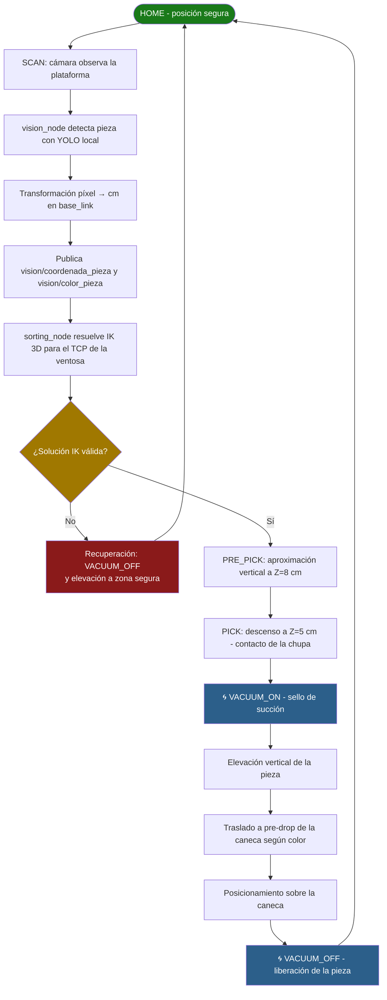

<div align="center">
<picture>
    <source srcset="https://imgur.com/5bYAzsb.png" media="(prefers-color-scheme: dark)">
    <source srcset="https://imgur.com/Os03JoE.png" media="(prefers-color-scheme: light)">
    
</picture>

<h3>Curso de Robótica 2026-I</h3>

<h1>PhantomX Pincher X100 con ROS 2 Jazzy</h1>

<h2>Proyecto Final — Celda de Clasificación Pick & Place con Visión de Máquina y Sistema de Vacío</h2>

<h4>Profesores: Pedro Fabián Cárdenas Herrera · Manuel Felipe Carranza Montenegro</h4>
<h4>Estudiantes: Isaac Montes Luna · Janan Libardo Carreño Riaño · Cristian Stiven Hoyos Peralta · Jesus Alberto Rivera Molina · Jose Andres Zapata Piñeros</h4>
    

<p>
  
  
  
  
  
  
</p>

</div>

---

Celda robotizada de *pick & place* construida alrededor del brazo **PhantomX Pincher** sobre **ROS 2 Jazzy** (Ubuntu 24.04). El sistema identifica piezas sobre la zona de recolección mediante **visión de máquina con YOLOv8**, calcula la pose de agarre y las deposita en la caneca correspondiente, utilizando una **ventosa con bomba de vacío** como herramienta de sujeción integrada al URDF del robot.

El equipo desarrolló el proyecto en **dos líneas de software complementarias** sobre la misma celda física:

- **Sistema principal (este workspace):** visión YOLOv8 **local** con coordenadas píxel→cm, cinemática inversa analítica 3D para el TCP de la ventosa, y control de vacío sincronizado con el ciclo.
- **Línea MoveIt 2 + API Roboflow:** planificación de trayectorias con MoveIt 2 (OMPL) vía commander en C++, inferencia remota por API y despliegue en Raspberry Pi 5 (ver [§11](#11-línea-de-desarrollo-moveit-2--api-roboflow)).

## Contenido

1. [Descripción de la solución y alcance](#1-descripción-de-la-solución-y-alcance)
2. [Celda física y plano de planta](#2-celda-física-y-plano-de-planta)
3. [Herramienta de sujeción por vacío](#3-herramienta-de-sujeción-por-vacío)
4. [Ciclo de operación](#4-ciclo-de-operación)
5. [Nodo de clasificación](#5-nodo-de-clasificación)
6. [Herramientas de prueba y simulación](#6-herramientas-de-prueba-y-simulación)
7. [Visión de máquina con YOLOv8 local](#7-visión-de-máquina-con-yolov8-local)
8. [Construcción del dataset en Roboflow](#8-construcción-del-dataset-en-roboflow)
9. [Entrenamiento del modelo](#9-entrenamiento-del-modelo)
10. [Calibración](#10-calibración)
11. [Línea de desarrollo MoveIt 2 + API Roboflow](#11-línea-de-desarrollo-moveit-2--api-roboflow)
12. [Bitácora del desarrollo](#12-bitácora-del-desarrollo)
13. [Instalación y ejecución](#13-instalación-y-ejecución)
14. [Videos de demostración](#14-videos-de-demostración)

---

## 1. Descripción de la solución y alcance

**Problema:** clasificar automáticamente piezas depositadas sobre la bandeja de recolección y transportarlas con un brazo robótico de 4 GDL hasta la caneca correspondiente.

**Funcionalidades logradas por el equipo (entre ambas líneas):**

- Detección de piezas con modelos YOLOv8 entrenados por el equipo (local con `best.pt` y remoto vía API Roboflow / Ultralytics HUB), más un método clásico por Hu Moments como alternativa sin red.
- Herramienta de **ventosa + bomba de vacío** diseñada, impresa en 3D e integrada al URDF; la pinza mecánica queda desactivada.
- Cinemática inversa analítica 3D continua para el TCP de la ventosa (sistema principal) y planificación de trayectorias con **MoveIt 2 / OMPL** con validación de colisiones (línea MoveIt).
- Transformación espacial píxel → centímetros referenciada al `base_link` (REP 103).
- Operación dual: simulación en RViz y robot real con servos Dynamixel (AX-12A / XL430).
- Clasificación a 4 canecas diferenciadas, con rutina de recuperación y parada de emergencia con corte de torque.
- GUIs de operación y calibración; despliegue de la línea MoveIt en Raspberry Pi 5.

**Estructura de este workspace:**

```
src/
├── pincher_description/     # URDF/Xacro del robot, herramienta de vacío (suction_cup.xacro),
│                            # mallas del PX100 y de la celda física completa
├── pincher_moveit_config/   # Configuración MoveIt 2: SRDF, OMPL, cinemática, límites
├── pincher_control/         # Driver Dynamixel (control_servo), GUI de operación y calibración
├── pincher_vision/          # Nodo YOLO de publicación continua (pxp_yolo_node)
└── pincher_sorting/         # Aplicación principal: sorting_node, vision_node, rutinas de prueba
    └── models/              # Pesos entrenados: best_piezascolor.pt / best_piezasnegras.pt
```

**Tópicos del sistema principal:**

| Tópico | Tipo | Función |
|---|---|---|
| `vision/coordenada_pieza` | `geometry_msgs/Point` | Posición (X, Y) de la pieza en cm para la cinemática inversa |
| `vision/color_pieza` | `String` | Color detectado; define la caneca destino |
| `/pincher/vacuum` | `String` | Comando de la bomba: `VACUUM_ON` / `VACUUM_OFF` |
| `/pincher/command` | `JointState` | Comando articular hacia el driver de los servos |
| `/pincher/status` | `String` | Estado publicado por el nodo activo |
| `/pincher/software_stop` | `Trigger` (srv) | Parada por software |
| `/visualization_marker` | `Marker` | Marcadores de referencia en RViz |

---

## 2. Celda física y plano de planta


**Componentes del kit de clasificación ensamblado:**

1. Manipulador robótico PhantomX Pincher AX-12 de 4 grados de libertad.
2. Plataforma base de MDF (554 mm × 360 mm × 9 mm) con acabado negro mate.
3. Base del manipulador con sistema de identificación numérica.
4. Sistema de succión por vacío con gripper intercambiable.
5. Controlador Raspberry Pi 5 en carcasa protectora.
6. Soporte de cámara con mástil vertical y brazo en voladizo.
7. Zona de recolección circular blanca (Ø146 mm).
8. Multitoma personalizada con control individual de subsistemas.
9–12. Canecas de depósito roja, verde, azul y amarilla.

**Disposición de elementos respecto a la base del robot (origen):**

| Elemento | Posición (x, y, z) [m] |
|---|---|
| Base del robot | (0.0, 0.0, 0.0) |
| Bandeja de recolección | (0.099, 0.0, 0.02) |
| Caneca roja | (−0.009, 0.117, 0.04) |
| Caneca verde | (0.196, 0.091, 0.04) |
| Caneca azul | (0.192, −0.088, 0.04) |
| Caneca amarilla | (−0.010, −0.110, 0.04) |
| Mesa de trabajo | (0.13, 0.0, −0.015) |
| Soporte de cámara | (0.26, 0.0, 0.009) |

Toda la celda está además modelada en `pincher_description` (STLs: `baseElementosFijos`, `zonaCircular146mm`, `ensambleCaneca`, `ensambleAirpump`, soporte de cámara), lo que permite reproducirla íntegramente en RViz.

**Evidencia — celda real vs. celda modelada:**


---

## 3. Herramienta de sujeción por vacío

La pinza mecánica quedó **desactivada** (comandada fija en 0.0) y el agarre se realiza con una **ventosa conectada a la bomba de vacío**, diseñada e impresa en 3D por el equipo.

### 3.1 Modelo integrado al URDF

La herramienta se define en el macro `suction_cup.xacro`, incluido desde `phantomx_pincher_arm.xacro`. Cadena de eslabones (juntas fijas):

```
gripper_finger_base_link
  └── suction_cup_anclaje_link      (anclajeGripper.stl)
        └── suction_cup_extension_link  (extensionGripper.stl)
              └── suction_cup_arm_link      (armSuctionCup.stl)
                    └── cuerpo y chupa de la ventosa
```

- **Montaje:** sobre `gripper_finger_base_link`, origen `xyz = (-0.03, 0, 0.019)` m, `rpy = (π/2, 0, π/2)`.
- **Mallas propias:** `anclajeGripper`, `extensionGripper`, `armSuctionCup`, `bodySuctionCup`, `suctionCupGripper`, topes izquierdo/derecho, y `collisionSuctionCup` como geometría de colisión (escala 0.001, mm → m).
- La cinemática inversa se resuelve para el **TCP de la ventosa**, no para la pinza.

**Evidencia — diseño y montaje de la herramienta:**


### 3.2 Control de la bomba

El ciclo publica en `/pincher/vacuum`:

- `VACUUM_ON` — en la pose de contacto (`pick`), antes de elevar la pieza.
- `VACUUM_OFF` — únicamente con la pieza sobre la caneca destino (`drop`).
- `VACUUM_OFF` — también en la **rutina de recuperación**, para liberar la pieza de forma segura ante fallos.

La bomba solo permanece activa durante el agarre y el transporte.

### 3.3 Alturas de operación calibradas

| Parámetro | Valor | Descripción |
|---|---|---|
| `z_approach_cm` | 8.0 | Aproximación vertical segura sobre la pieza |
| `z_surface_cm` | 5.0 | Altura de contacto exacto del sello de succión |

---

## 4. Ciclo de operación



---

## 5. Nodo de clasificación

### `sorting_node.py`

Nodo central del sistema principal: máquina de estados del *pick & place* con herramienta de vacío.

- **Máquina de estados.** Transiciones entre poses predefinidas (`home`, `scan`, `recovery`, `pre_drop_*`) y poses dinámicas calculadas en tiempo real (`pre_pick`, `pick`, `lift`, `drop`).
- **Cinemática inversa 3D para el TCP de la ventosa.** Cálculo **analítico y continuo** de los ángulos de cintura, hombro, codo y muñeca para cualquier coordenada (X, Y, Z) del espacio de trabajo. La pinza permanece fija en 0.0.
- **Control del vacío.** `VACUUM_ON`/`VACUUM_OFF` en `/pincher/vacuum`, sincronizado con contacto, transporte y liberación.
- **Integración con visión.** Suscrito a `vision/coordenada_pieza` y `vision/color_pieza` para posición y caneca destino (verde, azul, roja o amarilla).
- **Rutina de seguridad.** `_execute_recovery_routine` apaga el vacío y eleva el brazo a zona segura ante errores cinemáticos o de agarre.

---

## 6. Herramientas de prueba y simulación

### `test_routine_node.py` — Rutina de diagnóstico del sistema de vacío
Prueba automática de 6 pasos en orden estricto visitando las cuatro canecas (amarilla → azul → verde → roja): toma una pieza del centroide con `VACUUM_ON`, la traslada y la libera con `VACUUM_OFF`, validando que la IK alcanza todos los puntos con el TCP de la ventosa.

### `spawn_object.py` — Generador de objetos 3D
Publica mallas STL (cubos, cilindros) en la simulación; por defecto sobre la plataforma en el origen exacto (X = 9.6 cm, Z = 2.75 cm). Configurable con `--shape`, `--color`, `--scale`, posición y rotación.

### `test_block_publisher.py` — Simulador de detección visual
Publica coordenadas y colores de prueba en los tópicos de visión sin cámara física, y despliega el marcador 3D correspondiente en RViz (cubo, cilindro, triángulo o pentágono).

### `go_to_tray_origin.py` — Posicionamiento y marcador de referencia
Lleva el brazo al centro de la plataforma con ángulos predefinidos (cintura 0.0°, hombro +13.0°, codo +129.0°, muñeca +32.0°) por `/pincher/command`, y mantiene a 2 Hz una esfera roja de 4 cm sobre el centro (X = 0.096 m, Y = 0.0 m, Z = 0.04 m) en el marco `world`.

---

## 7. Visión de máquina con YOLOv8 local

### `vision_node.py`

- Carga los pesos entrenados incluidos en el repo: `best_piezascolor.pt` (por defecto) o `best_piezasnegras.pt` (parámetro `model_name`).
- Umbral de confianza configurable (`conf_threshold`, por defecto 0.5).
- **Transformación espacial 2D** píxel → cm referenciada al `base_link` cumpliendo **REP 103** (+X derecha, +Y adelante).
- Publica `vision/coordenada_pieza` y `vision/color_pieza`, y escucha `/pincher/status` para sincronizarse con el ciclo del brazo.

`pxp_yolo_node.py` (paquete `pincher_vision`) es la variante de publicación continua a 10 Hz, que además emite `vision/imagen_procesada` con las detecciones dibujadas.

**Evidencia — detección en vivo del sistema principal:**


---

## 8. Construcción del dataset en Roboflow

1. **Proyecto y carga de datos.** Proyecto tipo **Object Detection** con las clases a reconocer; se cargan imágenes o videos de la cámara del robot (de un video, Roboflow extrae fotogramas automáticamente).
2. **Etiquetado.** *Bounding boxes* ajustadas a los contornos de cada objeto con su clase; **Label Assist** predice las etiquetas restantes tras las primeras anotaciones.
3. **Preprocesamiento y aumento de datos.** Redimensionamiento uniforme (520 × 520 px), corrección de orientación, y *augmentation* con brillo, rotaciones y ruido para robustecer el modelo ante condiciones variables.
4. **División del conjunto:** Train ~80 % · Valid ~10 % · Test ~10 %, evitando sobreajuste y permitiendo evaluación objetiva.
5. **Exportación YOLOv8:** `.zip` con `images/`, `labels/` y `data.yaml` (ubicación del dataset, `nc` y nombres de clases).

---

## 9. Entrenamiento del modelo

Entrenamiento en **Google Colab** (GPU) con transfer learning desde YOLOv8 Nano:

```bash
yolo task=detect mode=train model=yolov8n.pt data=data.yaml epochs=100 imgsz=520
```

| Parámetro | Función |
|-----------|---------|
| `model=yolov8n.pt` | Preentrenado **YOLOv8 Nano** (transfer learning) |
| `epochs=100` | 100 pasadas sobre el conjunto de entrenamiento |
| `imgsz=520` | Resolución de entrada 520 × 520 px |

Con cada época el *loss* disminuye y la precisión aumenta; la mejor versión sobre **validación** se guarda como `best.pt`. El equipo entrenó dos variantes locales (`best_piezascolor.pt`, `best_piezasnegras.pt`) y re-entrenó el modelo en la plataforma Roboflow para la inferencia por API de la línea MoveIt (§11).


---

## 10. Calibración

### 10.1 Cámara: píxeles → centímetros

```python
# Píxeles que corresponden al centro físico de la base del robot (0,0)
self.BASE_PIXEL_X = 320.0
self.BASE_PIXEL_Y = 440.0
# Factor de conversión (medir píxeles desplazados al mover el objeto 10 cm)
self.CM_POR_PIXEL_X = 0.05
self.CM_POR_PIXEL_Y = 0.05
```

Ajuste fino por parámetro ROS: `camera_offset_x_cm = -1.0`. La compensación de posición se gestiona en el nodo de cámara, no en el planificador.

### 10.2 Alturas de la ventosa
`z_approach_cm = 8.0` y `z_surface_cm = 5.0` (§3.3), como parámetros ROS 2 del `sorting_node`.

### 10.3 Motores
- GUI con pestaña de calibración de pick en dos pasos (*Acercamiento* / *Superficie*) y guardado a `pick_place_calibration.yaml`.
- Perfiles de motor AX-12A / XL430 en `config/ax12a.yaml` y `config/xl430.yaml`.
- En la línea MoveIt: offsets articulares centralizados en `joint_calibration.yaml` (orden `[ID1_shoulder_pan, ID2_shoulder_lift, ID3_elbow_flex, ID4_wrist_flex, gripper]`) y corrección de signos de giro de los 4 motores para que el sentido físico coincida con el modelo en RViz.

---

## 11. Línea de desarrollo MoveIt 2 + API Roboflow

Subsistema desarrollado en paralelo por el equipo sobre la misma celda, con planificación de trayectorias mediante **MoveIt 2** y despliegue en **Raspberry Pi 5**. Repositorio: [Proyecto-Robotica-Phanton-pincherx](https://github.com/DuvanTique/Proyecto-Robotica-Phanton-pincherx).

### 11.1 Arquitectura

- **`commander` (C++):** puente entre comandos de alto nivel y MoveIt. Los nodos Python publican `PoseCommand` en `/pose_command` y el commander planifica y ejecuta con `MoveGroupInterface` (OMPL), incluyendo **hasta 10 reintentos de planificación** ante fallos.
- **`clasificador_node` / `object_sorting_node` (Python):** máquinas de estados del ciclo, suscritas a `/figure_type` y a las poses de canecas.
- **Visión por API:** `recognition_node` consulta bajo demanda la API de **Roboflow** (o **Ultralytics HUB** como backend alternativo) enviando la imagen en base64; `camera_recognition_node` implementa además un método clásico por **Hu Moments** (`cv2.matchShapes`) sin dependencia de red.
- **`scene_objects_node`:** publica los objetos de colisión (mesa, bandeja, canecas, soporte de cámara) en la escena de planificación de MoveIt.
- **GUI Tkinter:** cámara en vivo con ROI, estado de la FSM, conteos por tipo, estado de MoveIt y de torque, y controles Scan / Start / Stop / E-STOP / Reset / Home / Next / gripper manual.

### 11.2 Decisiones y hallazgos propios de esta línea

- **Inferencia delegada a la nube:** la Raspberry Pi 5 no soporta razonablemente PyTorch/Ultralytics local (RAM y tiempo de inferencia), así que la clasificación se resolvió por petición HTTP, dejando a la Pi solo el envío de la imagen y la lectura del JSON.
- **Singularidad en Home:** con todas las articulaciones exactamente en 0 rad, el solver KDL fallaba de forma errática en ciclos consecutivos. Se redefinió Home con offset de 1° por articulación (`[0.01745, 0.01745, 0.01745, 0.01745]` rad) y el problema desapareció.
- **Escaneo bajo demanda:** la API solo se consulta al presionar *Scan* o al cerrar cada ciclo, evitando saturar el enlace WiFi de la Pi.

### 11.3 Resultados de esta línea

- Ciclo completo funcional en simulación (~**30 s por pieza**) y en robot real (**35–40 s por pieza**, limitado por la velocidad de los AX-12A y la latencia de la API).
- Clasificación por forma geométrica hacia caneca asignada: cubo → roja, cilindro → verde, pentágono → azul, rectángulo → amarilla.
- Limitación registrada: recolección desde pose fija en el centro de la bandeja (la recolección en posición arbitraria la resuelve el sistema principal con la transformación píxel→cm).

### 11.4 Evidencias de RViz y GUI

**Escena de planificación completa** (robot, bandeja, canecas y objetos de colisión):


**Trayectorias planificadas con MoveIt** (recolección y descarga):


**Validación de colisiones:**


**Interfaz gráfica de operación** (cámara en vivo con ROI, estado de la FSM, conteos y controles):


---

## 12. Bitácora del desarrollo

### 12.1 Decisiones de diseño

El proyecto se abordó en dos líneas coordinadas sobre la misma celda: una orientada a **planificación con MoveIt 2** y despliegue embebido (Raspberry Pi 5, inferencia por API), y otra orientada a **recolección en posición arbitraria** con visión local (YOLOv8 con `best.pt`, transformación píxel→cm) y cinemática inversa analítica para el TCP de la ventosa. La herramienta de sujeción evolucionó de la pinza mecánica al **sistema de vacío**, diseñado en CAD, impreso en 3D e integrado al URDF (`suction_cup.xacro`), con lo cual la pinza quedó desactivada y todo el cálculo cinemático se refirió a la chupa.

Otras decisiones transversales: control del gripper/vacío fuera del planificador (comandos directos, ciclo más corto), separación estricta percepción ↔ manipulación por tópicos ROS 2, y modelado completo de la celda física en el URDF para desarrollar y validar primero en simulación.

### 12.2 Dificultades y soluciones

- **Singularidad todo-en-cero (línea MoveIt):** planificación errática del solver KDL desde Home exacto; resuelto con offset de 1° por articulación.
- **Despliegue de deep learning en la Raspberry Pi 5:** inviable por RAM e inferencia sin GPU; se migró la clasificación a la API de Roboflow (imagen en base64 → JSON).
- **Sombras que confunden cubo/pentágono:** con iluminación lateral, las sombras añaden aristas aparentes a la silueta. Solución combinada: iluminación cenital difusa, umbral de confianza elevado y re-entrenamiento con variaciones de luz.
- **Contacto del sello de succión:** la altura de pick se recalibró para la ventosa (`z_surface` de 1.45 cm con pinza a **5.0 cm** con chupa, y aproximación de 6 a **8 cm**), junto con el ajuste fino de alineación de cámara (`camera_offset_x_cm = -1.0`).

### 12.3 Resultados

El sistema opera de extremo a extremo en simulación y sobre el robot real. La línea MoveIt registró ~30 s por pieza en simulación y 35–40 s en hardware; el sistema principal añade la recolección de piezas en **posición arbitraria** de la bandeja gracias a la transformación píxel→cm, y el agarre por succión con activación del vacío únicamente durante toma y transporte.

### 12.4 Conclusiones

El desarrollo simulado previo (RViz, y MoveIt 2 en la línea de planificación) resultó indispensable para iterar con seguridad: cada trayectoria se visualiza y se valida contra la escena antes de mover el hardware, exponiendo temprano errores tanto cinemáticos como de la lógica de estados.

La iluminación demostró ser una **variable de diseño de la celda física**, no un detalle de posprocesamiento: las sombras laterales degradan la clasificación de forma sistemática, por lo que el control lumínico debe planearse junto con la disposición mecánica.

Delegar la inferencia a un servicio externo habilita hardware embebido de bajo costo al precio de una dependencia de conectividad; mantener además el modelo local (`best.pt`) y el método clásico por Hu Moments le dio al equipo redundancia frente a ese riesgo.

Finalmente, sustituir el pinzamiento mecánico por succión simplifica la interacción con piezas de cara superior plana, pero traslada la exigencia a la **calibración vertical**: el sello de la chupa requiere alturas de contacto exactas y una verificación de agarre explícita en el ciclo.

---

## 13. Instalación y ejecución

### 13.1 Sistema principal (este workspace)

```bash
# Entorno virtual con visibilidad de los paquetes de ROS 2 (evita conflictos PEP 668)
python3 -m venv --system-site-packages venv_vision
source venv_vision/bin/activate
pip install ultralytics
pip install "numpy<2"   # evita el crash de matplotlib con NumPy 2

# Compilación
cd ~/ros2_ws
rm -rf build/ install/ log/
colcon build
source install/setup.bash

# Sistema completo (robot + sorting + visión + GUI + RViz)
ros2 launch pincher_sorting system_sorting.launch.py \
  use_hardware:=true port:=/dev/ttyUSB0 motor_model:=ax12a \
  start_vision:=true camera_device:=/dev/video0

# Rutina de diagnóstico de las 4 canecas con vacío
ros2 launch pincher_sorting test_routine.launch.py
```

Argumentos del launch: `use_hardware`, `motor_model` (ax12a/xl430), `port`, `baudrate`, `start_gui`, `start_rviz`, `start_vision`, `show_window`, `camera_device`.

### 13.2 Línea MoveIt 2 + Roboflow

```bash
sudo apt install -y \
  ros-jazzy-ros2-control ros-jazzy-ros2-controllers ros-jazzy-xacro \
  ros-jazzy-joint-state-publisher-gui ros-jazzy-tf-transformations \
  ros-jazzy-moveit* ros-jazzy-dynamixel-sdk ros-jazzy-control-msgs \
  python3-pip python3-colcon-common-extensions python3-tk \
  python3-dotenv git-lfs ros-jazzy-usb-cam
pip install --break-system-packages requests transforms3d pillow

git lfs install
git clone https://github.com/DuvanTique/Proyecto-Robotica-Phanton-pincherx.git
cd Proyecto-Robotica-Phanton-pincherx/phantom_ws
source /opt/ros/jazzy/setup.bash && ./build.sh && source install/setup.bash

# Credenciales de la API (plantilla .env.example): PINCHER_API_KEY, PINCHER_MODEL_ID
cp src/pincher_control/config/.env.example src/pincher_control/config/.env

# Simulación / robot real / visión / GUI
ros2 launch phantomx_pincher_bringup phantomx_pincher.launch.py use_real_robot:=false start_clasificador:=true
ros2 launch phantomx_pincher_bringup phantomx_pincher.launch.py use_real_robot:=true start_clasificador:=true port:=/dev/ttyUSB1
ros2 launch phantomx_pincher_bringup vision_bringup.launch.py start_camera:=true camera_device:=/dev/video4 start_clasificador:=true
ros2 run pincher_control pincher_gui
```

---

## 14. Videos de demostración

- 🎥 **Línea MoveIt 2 + Roboflow** (simulación y robot real):
- 🎥 **Sistema principal con ventosa de vacío:** *()*
